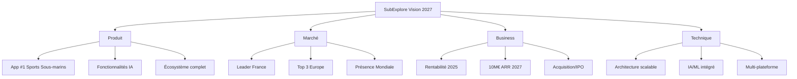
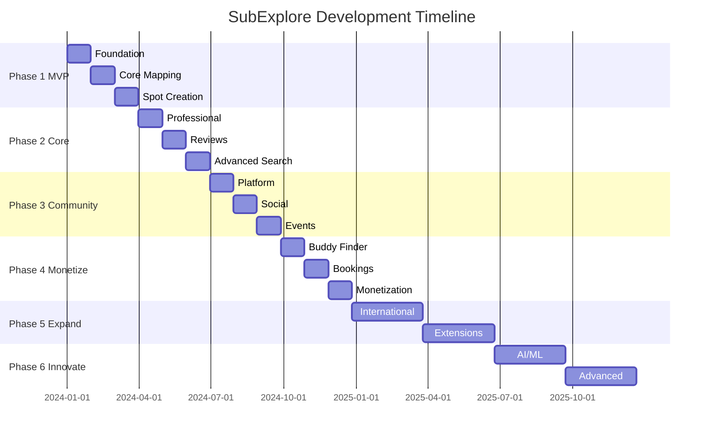

# ROADMAP ET VISION FUTURE - SUBEXPLORE
## Plan de Développement sur 24 Mois

---

## TABLE DES MATIÈRES

1. [Vision et Objectifs Stratégiques](#1-vision-et-objectifs-stratégiques)
2. [Phase 1 - MVP (Mois 1-3)](#2-phase-1---mvp-mois-1-3)
3. [Phase 2 - Core Features (Mois 4-6)](#3-phase-2---core-features-mois-4-6)
4. [Phase 3 - Communauté (Mois 7-9)](#4-phase-3---communauté-mois-7-9)
5. [Phase 4 - Monétisation (Mois 10-12)](#5-phase-4---monétisation-mois-10-12)
6. [Phase 5 - Expansion (Mois 13-18)](#6-phase-5---expansion-mois-13-18)
7. [Phase 6 - Innovation (Mois 19-24)](#7-phase-6---innovation-mois-19-24)
8. [KPIs et Métriques de Succès](#8-kpis-et-métriques-de-succès)
9. [Budget et Ressources](#9-budget-et-ressources)
10. [Risques et Mitigation](#10-risques-et-mitigation)

---

## 1. VISION ET OBJECTIFS STRATÉGIQUES

### 1.1 Vision à Long Terme

```yaml
Vision_2026:
  Mission: "Devenir LA plateforme de référence mondiale pour la communauté des sports sous-marins"
  
  Valeurs:
    - Sécurité avant tout
    - Communauté inclusive
    - Respect de l'environnement marin
    - Innovation technologique
    - Transparence et confiance
    
  Positionnement:
    - Leader en France (2025)
    - Expansion Europe (2026)
    - Présence mondiale (2027)
    
  Impact:
    Utilisateurs: 1 million+ actifs
    Spots: 100,000+ référencés
    Structures: 10,000+ partenaires
    Réservations: 1,000+ /jour
    Communauté: 50+ ambassadeurs
```

### 1.2 Objectifs Stratégiques



---

## 2. PHASE 1 - MVP (MOIS 1-3)

### 2.1 Sprint 1: Foundation (Mois 1)

#### Semaine 1-2: Setup & Infrastructure
```yaml
Tâches:
  Infrastructure:
    - Setup Supabase production
    - Configuration CI/CD
    - Environnements dev/staging/prod
    - Monitoring et alerting
    
  Architecture:
    - Structure solution .NET MAUI
    - Clean Architecture implementation
    - Base de données (script SQL)
    - Services de base
    
  Équipe:
    - Onboarding développeurs
    - Documentation technique
    - Git workflow
    - Code standards
    
Livrables:
  - Environnement de développement fonctionnel
  - Pipeline CI/CD opérationnel
  - Base de données déployée
  - Documentation initiale
```

#### Semaine 3-4: Authentication & User Management
```yaml
Tâches:
  Authentication:
    - Supabase Auth integration
    - JWT tokens management
    - Secure storage
    - Session management
    
  User Management:
    - Registration flow
    - Login/Logout
    - Profile creation
    - Password recovery
    
  UI/UX:
    - Splash screen
    - Login/Register pages
    - Profile page base
    - Navigation shell
    
Livrables:
  - Système d'authentification complet
  - Gestion des utilisateurs
  - UI de base fonctionnelle
```

### 2.2 Sprint 2: Core Mapping (Mois 2)

#### Semaine 5-6: Map Integration
```yaml
Tâches:
  Carte:
    - Google Maps/Apple Maps integration
    - Géolocalisation utilisateur
    - Affichage des spots
    - Clustering optimisé
    
  Données:
    - Import spots initiaux
    - Seed data Finistère
    - API spots nearby
    - Cache géographique
    
  Performance:
    - Lazy loading pins
    - Optimisation rendu
    - Cache tiles
    
Livrables:
  - Carte fonctionnelle
  - 100+ spots test
  - Géolocalisation active
```

#### Semaine 7-8: Spot Details & Search
```yaml
Tâches:
  Détails Spot:
    - Page détail complète
    - Galerie photos
    - Caractéristiques
    - Navigation GPS
    
  Recherche:
    - Filtres (difficulté, type, etc.)
    - Recherche textuelle
    - Tri par distance/rating
    - Sauvegarde filtres
    
  Favoris:
    - Ajout/suppression favoris
    - Liste des favoris
    - Sync avec serveur
    
Livrables:
  - Consultation spots complète
  - Système de recherche
  - Gestion des favoris
```

### 2.3 Sprint 3: Spot Creation (Mois 3)

#### Semaine 9-10: Creation Workflow
```yaml
Tâches:
  Création:
    - Workflow multi-étapes
    - Validation formulaires
    - Upload photos
    - Géolocalisation précise
    
  Validation:
    - Soumission pour validation
    - Statuts de validation
    - Notifications créateur
    
  Data:
    - Compression images
    - Stockage Supabase
    - Optimisation uploads
    
Livrables:
  - Création de spots complète
  - Système de validation basique
  - Gestion des médias
```

#### Semaine 11-12: Testing & Polish
```yaml
Tâches:
  Tests:
    - Tests unitaires (>80% coverage)
    - Tests d'intégration
    - Tests UI automatisés
    - Beta testing interne
    
  Corrections:
    - Bug fixes critiques
    - Optimisations performance
    - Polish UI/UX
    
  Préparation Launch:
    - App Store assets
    - Play Store listing
    - Landing page
    - Documentation utilisateur
    
Livrables:
  - MVP stable et testé
  - Assets marketing
  - Documentation complète
```

### 2.4 Métriques MVP

```yaml
Objectifs_MVP:
  Utilisateurs: 500 early adopters
  Spots: 200 validés
  Rétention: 40% J7
  Crashes: <1%
  App Rating: >4.0
  
Features_MVP:
  ✅ Authentication
  ✅ User profiles
  ✅ Map with spots
  ✅ Spot details
  ✅ Search & filters
  ✅ Favorites
  ✅ Spot creation
  ✅ Basic validation
  ⏳ Reviews (basique)
  ❌ Messaging
  ❌ Bookings
  ❌ Community
```

---

## 3. PHASE 2 - CORE FEATURES (MOIS 4-6)

### 3.1 Sprint 4: Professional Features (Mois 4)

```yaml
Semaine_13-14:
  Structures:
    - CRUD structures
    - Page détail structure
    - Services & tarifs
    - Horaires ouverture
    
  Verification:
    - Upload documents
    - Processus vérification
    - Badges vérification
    
Semaine_15-16:
  Dashboard_Pro:
    - Espace pro
    - Gestion profil
    - Statistiques
    - Réponse avis
    
  Integration:
    - Import données existantes
    - API partenaires
    - Sync calendriers
```

### 3.2 Sprint 5: Reviews & Ratings (Mois 5)

```yaml
Semaine_17-18:
  Reviews:
    - Système notation 5 étoiles
    - Commentaires détaillés
    - Photos dans avis
    - Réponse propriétaire
    
  Moderation:
    - Queue modération
    - Outils modérateurs
    - Détection spam
    - Reporting utilisateurs
    
Semaine_19-20:
  Gamification:
    - Badges contributeurs
    - Niveaux expertise
    - Leaderboard local
    - Récompenses
    
  Analytics:
    - Tracking événements
    - Funnel conversion
    - User behavior
    - Performance metrics
```

### 3.3 Sprint 6: Advanced Search (Mois 6)

```yaml
Semaine_21-22:
  Search_Engine:
    - Elasticsearch integration
    - Full-text search
    - Fuzzy matching
    - Search suggestions
    
  AI_Features:
    - Recommandations personnalisées
    - Similar spots
    - Trending spots
    - Predictive search
    
Semaine_23-24:
  Notifications:
    - Push notifications
    - In-app notifications
    - Email notifications
    - Préférences utilisateur
    
  Offline_Mode:
    - Cache offline
    - Sync queue
    - Offline maps
    - Data persistence
```

---

## 4. PHASE 3 - COMMUNAUTÉ (MOIS 7-9)

### 4.1 Sprint 7: Community Platform (Mois 7)

```yaml
Blog_Platform:
  - Articles création/édition
  - Rich text editor
  - Catégories & tags
  - Featured posts
  - Commentaires
  - Likes & shares
  
User_Generated_Content:
  - Trip reports
  - Dive logs
  - Photo galleries
  - Video integration
  - Stories feature
```

### 4.2 Sprint 8: Social Features (Mois 8)

```yaml
Social_Network:
  - Follow system
  - Activity feed
  - User mentions
  - Hashtags
  - Share content
  - Social login
  
Groups:
  - Créer/rejoindre groupes
  - Discussions groupe
  - Événements groupe
  - Modération groupe
  - Private/public groups
```

### 4.3 Sprint 9: Events & Meetups (Mois 9)

```yaml
Events:
  - Création événements
  - Calendrier événements
  - RSVP & participants
  - Rappels automatiques
  - Integration calendrier
  
Meetups:
  - Sorties organisées
  - Co-voiturage
  - Chat événement
  - Check-in location
  - Photos événement
```

---

## 5. PHASE 4 - MONÉTISATION (MOIS 10-12)

### 5.1 Sprint 10: Buddy Finder (Mois 10)

```yaml
Matching_System:
  - Profils buddy
  - Algorithme matching
  - Swipe interface
  - Chat matches
  - Safety features
  - Video calls
  
Premium_Features:
  - Unlimited swipes
  - Super likes
  - Boost profile
  - Advanced filters
  - See who liked you
```

### 5.2 Sprint 11: Booking System (Mois 11)

```yaml
Reservations:
  - Calendrier disponibilités
  - Booking workflow
  - Confirmation emails
  - Reminders
  - Cancellation policy
  - Waitlist
  
Payment_Integration:
  - Stripe integration
  - Multiple payment methods
  - Invoicing
  - Refunds
  - Commission system
```

### 5.3 Sprint 12: Monetization (Mois 12)

```yaml
Subscriptions:
  - Free tier
  - Premium user (9.99€/mois)
  - Pro (29.99€/mois)
  - Enterprise (custom)
  
Advertising:
  - Banner ads
  - Sponsored spots
  - Featured structures
  - Native ads
  - Ad targeting
  
Analytics_Dashboard:
  - Revenue tracking
  - Conversion funnels
  - Cohort analysis
  - LTV calculation
  - Churn analysis
```

---

## 6. PHASE 5 - EXPANSION (MOIS 13-18)

### 6.1 International Expansion (Mois 13-15)

```yaml
Mois_13_Preparation:
  - Internationalisation code
  - Multi-language support
  - Currency support
  - Legal compliance
  - Local partnerships
  
Mois_14_Spain_Portugal:
  - Traduction ES/PT
  - Import spots Espagne
  - Import spots Portugal
  - Local marketing
  - Influencer partnerships
  
Mois_15_Italy_Greece:
  - Traduction IT/EL
  - Mediterranean focus
  - Summer campaign
  - Diving schools partnerships
  - Local events
```

### 6.2 Platform Extensions (Mois 16-18)

```yaml
Mois_16_Web_Platform:
  - Web app React
  - Desktop features
  - SEO optimization
  - Blog platform
  - Partner portal
  
Mois_17_API_Marketplace:
  - Public API
  - Developer portal
  - API documentation
  - Rate limiting
  - Webhooks
  
Mois_18_Integrations:
  - Garmin Connect
  - Suunto app
  - Strava
  - Instagram
  - TripAdvisor
```

---

## 7. PHASE 6 - INNOVATION (MOIS 19-24)

### 7.1 AI & Machine Learning (Mois 19-21)

```yaml
Mois_19_AI_Assistant:
  - ChatGPT integration
  - Dive planning AI
  - Conditions prediction
  - Personalized recommendations
  - Natural language search
  
Mois_20_Computer_Vision:
  - Species identification
  - Automatic spot detection
  - Photo quality scoring
  - Depth estimation
  - Visibility analysis
  
Mois_21_Predictive_Analytics:
  - Best diving conditions
  - Crowd prediction
  - Price optimization
  - Churn prediction
  - Demand forecasting
```

### 7.2 Advanced Features (Mois 22-24)

```yaml
Mois_22_VR_AR:
  - VR dive preview
  - AR navigation
  - 360° photos
  - Virtual tours
  - AR species guide
  
Mois_23_IoT_Wearables:
  - Dive computer sync
  - Real-time tracking
  - Emergency alerts
  - Health monitoring
  - Automatic logging
  
Mois_24_Blockchain:
  - NFT dive certificates
  - Crypto payments
  - Decentralized reviews
  - Smart contracts
  - Token rewards
```

---

## 8. KPIs ET MÉTRIQUES DE SUCCÈS

### 8.1 Business Metrics

```yaml
User_Metrics:
  MAU_Targets:
    Month_3: 500
    Month_6: 5,000
    Month_12: 50,000
    Month_18: 200,000
    Month_24: 500,000
  
  Revenue_Targets:
    Month_6: 0€ (pre-revenue)
    Month_12: 10K€ MRR
    Month_18: 100K€ MRR
    Month_24: 500K€ MRR
  
  Geographic_Distribution:
    Month_6: France 100%
    Month_12: France 80%, EU 20%
    Month_18: France 60%, EU 35%, World 5%
    Month_24: France 40%, EU 40%, World 20%
```

### 8.2 Product Metrics

```yaml
Engagement:
  DAU/MAU: >25%
  Session_Length: >5 minutes
  Sessions_Per_Day: >2
  Retention_D7: >40%
  Retention_D30: >20%
  
Growth:
  Viral_Coefficient: >0.5
  CAC: <10€
  LTV: >100€
  LTV/CAC: >10
  Organic_Growth: >60%
  
Quality:
  App_Rating: >4.5
  Crash_Rate: <0.5%
  ANR_Rate: <0.1%
  Load_Time: <2s
  API_Latency: <200ms
```

### 8.3 Tracking Dashboard

```python
# KPI Tracking Configuration
KPI_DASHBOARD = {
    "real_time": [
        "active_users",
        "current_bookings",
        "api_latency",
        "error_rate"
    ],
    "daily": [
        "new_users",
        "dau",
        "revenue",
        "bookings",
        "spots_created",
        "reviews_posted"
    ],
    "weekly": [
        "wau",
        "retention_d7",
        "conversion_rate",
        "avg_session_duration",
        "feature_adoption"
    ],
    "monthly": [
        "mau",
        "mrr",
        "churn_rate",
        "ltv",
        "cac",
        "nps_score"
    ]
}
```

---

## 9. BUDGET ET RESSOURCES

### 9.1 Budget Prévisionnel

```yaml
Development_Costs:
  Phase_1_MVP:
    Development: 50,000€
    Infrastructure: 5,000€
    Tools: 2,000€
    Total: 57,000€
  
  Phase_2_Core:
    Development: 40,000€
    Infrastructure: 8,000€
    Marketing: 10,000€
    Total: 58,000€
  
  Phase_3_Community:
    Development: 35,000€
    Infrastructure: 10,000€
    Marketing: 15,000€
    Total: 60,000€
  
  Phase_4_Monetization:
    Development: 45,000€
    Infrastructure: 15,000€
    Marketing: 25,000€
    Total: 85,000€
  
  Phase_5_Expansion:
    Development: 60,000€
    Infrastructure: 25,000€
    Marketing: 50,000€
    Localization: 20,000€
    Total: 155,000€
  
  Phase_6_Innovation:
    Development: 80,000€
    Infrastructure: 35,000€
    Marketing: 60,000€
    R&D: 30,000€
    Total: 205,000€
  
  Grand_Total: 620,000€
```

### 9.2 Équipe Requise

```yaml
Phase_1_Team: # 4 personnes
  - Product Owner
  - Lead Developer
  - Mobile Developer
  - UI/UX Designer (part-time)
  
Phase_2_Team: # 6 personnes
  + Backend Developer
  + QA Engineer
  
Phase_3_Team: # 8 personnes
  + Community Manager
  + Content Creator
  
Phase_4_Team: # 11 personnes
  + Business Developer
  + Marketing Manager
  + Data Analyst
  
Phase_5_Team: # 15 personnes
  + DevOps Engineer
  + 2x Developers
  + Customer Success
  
Phase_6_Team: # 20 personnes
  + AI/ML Engineer
  + Product Manager
  + Sales Team (2)
  + Support Team (1)
```

### 9.3 Infrastructure Scaling

```yaml
Infrastructure_Evolution:
  MVP:
    Supabase: Free tier
    CDN: Cloudflare free
    Monitoring: Basic
    Cost: ~100€/month
  
  Growth_Stage:
    Supabase: Pro (25€/month)
    CDN: Cloudflare Pro
    Monitoring: DataDog
    Cost: ~500€/month
  
  Scale_Stage:
    Supabase: Team (599€/month)
    CDN: Enterprise
    Monitoring: Full suite
    Redis: Cluster
    Cost: ~2,000€/month
  
  Enterprise:
    Custom: Infrastructure
    Multi-region: Deployment
    24/7: Support
    Cost: ~10,000€/month
```

---

## 10. RISQUES ET MITIGATION

### 10.1 Analyse des Risques

```yaml
Technical_Risks:
  Scalability_Issues:
    Probabilité: Moyenne
    Impact: Élevé
    Mitigation:
      - Architecture scalable dès le début
      - Load testing régulier
      - Plan de scaling préparé
      - Monitoring proactif
  
  Data_Breach:
    Probabilité: Faible
    Impact: Critique
    Mitigation:
      - Security by design
      - Audits réguliers
      - Encryption everywhere
      - RGPD compliance
      - Cyber insurance
  
Business_Risks:
  Competition:
    Probabilité: Élevée
    Impact: Moyen
    Mitigation:
      - First mover advantage
      - Strong community
      - Unique features
      - Partnerships exclusifs
  
  Regulatory_Changes:
    Probabilité: Moyenne
    Impact: Moyen
    Mitigation:
      - Legal watch
      - Compliance buffer
      - Flexible architecture
      - Legal counsel
  
Market_Risks:
  Low_Adoption:
    Probabilité: Moyenne
    Impact: Élevé
    Mitigation:
      - MVP validation
      - Iterative development
      - User feedback loops
      - Pivot capability
  
  Seasonality:
    Probabilité: Certaine
    Impact: Moyen
    Mitigation:
      - International expansion
      - Indoor activities
      - Content platform
      - Subscription model
```

### 10.2 Plan de Contingence

```yaml
Scenario_Planning:
  Best_Case:
    Growth: 200% YoY
    Funding: Series A Year 2
    Exit: Acquisition Year 3-5
    
  Base_Case:
    Growth: 100% YoY
    Funding: Seed Year 2
    Profitability: Year 3
    
  Worst_Case:
    Growth: 50% YoY
    Bootstrapped: Throughout
    Pivot: Required Year 2
    
Pivot_Options:
  Option_1: B2B SaaS for diving centers
  Option_2: White-label platform
  Option_3: Content/Media platform
  Option_4: Equipment marketplace
```

---

## CONCLUSION

### Timeline Summary



### Success Factors

1. **Execution Excellence**: Livrer à temps avec qualité
2. **User-Centric**: Écoute continue des utilisateurs
3. **Data-Driven**: Décisions basées sur les métriques
4. **Agile Mindset**: Adaptation rapide aux changements
5. **Strong Team**: Équipe passionnée et compétente
6. **Community First**: Construire une vraie communauté
7. **Safety Focus**: Jamais de compromis sur la sécurité

### Next Steps

1. ✅ Finaliser le financement initial
2. ✅ Recruter l'équipe core
3. ✅ Setup infrastructure
4. ⏳ Lancer le développement MVP
5. ⏳ Engager les early adopters
6. ⏳ Itérer basé sur feedback

---

**Document créé le**: {{DATE}}
**Version**: 1.0
**Statut**: Roadmap Officielle
**Prochaine révision**: Trimestrielle

*"The best way to predict the future is to invent it" - Alan Kay*

*SubExplore - Diving into the future of underwater sports* 🌊