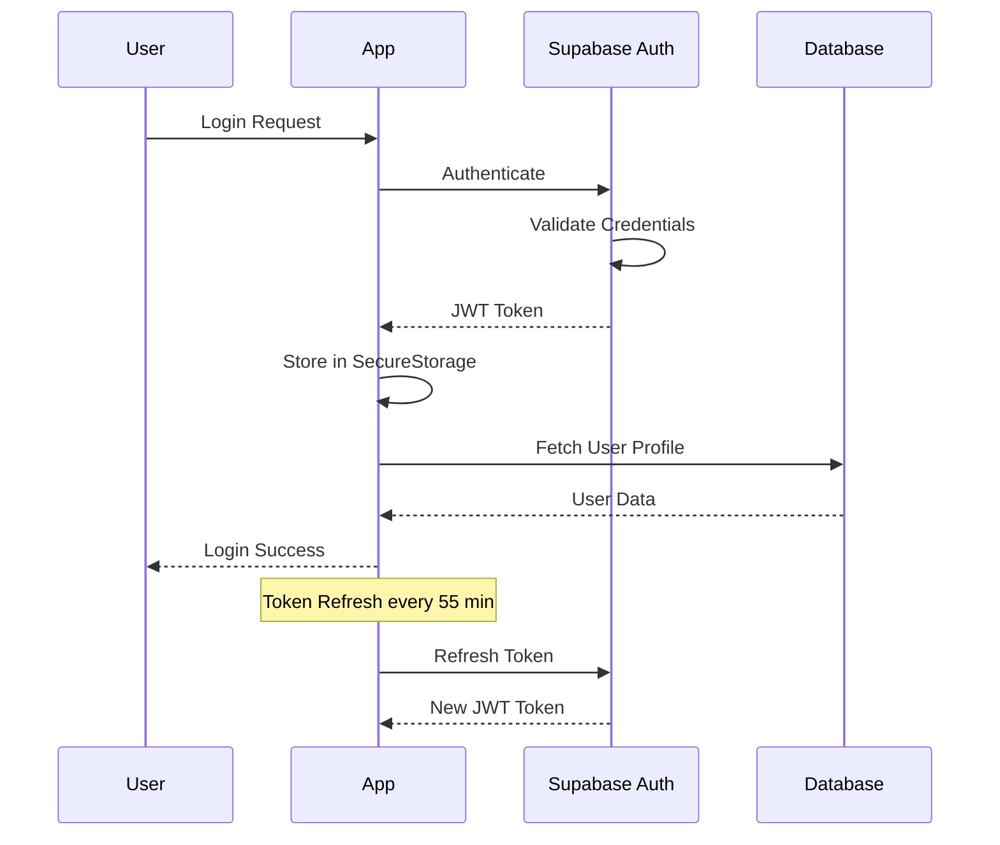

# CAHIER DES CHARGES COMPLET - SUBEXPLORE
## Application Mobile Communautaire pour les Sports Sous-Marins

---

## TABLE DES MATIÈRES

1. [Vision et Objectifs](#1-vision-et-objectifs)
2. [Architecture Technique Globale](#2-architecture-technique-globale)
3. [Modèle de Données Complet](#3-modèle-de-données-complet)
4. [Système d'Authentification et Rôles](#4-système-dauthentification-et-rôles)
5. [Module Cartographie et Spots](#5-module-cartographie-et-spots)
6. [Module Structures et Commerces](#6-module-structures-et-commerces)
7. [Module Communauté et Partage](#7-module-communauté-et-partage)
8. [Module Rencontre entre Pratiquants](#8-module-rencontre-entre-pratiquants)
9. [Module Messagerie](#9-module-messagerie)
10. [Module Réservation de Services](#10-module-réservation-de-services)
11. [Module Publicité et Monétisation](#11-module-publicité-et-monétisation)
12. [Système de Modération](#12-système-de-modération)
13. [Intégrations Externes](#13-intégrations-externes)
14. [Sécurité et Conformité](#14-sécurité-et-conformité)
15. [Performance et Scalabilité](#15-performance-et-scalabilité)
16. [Plan de Développement](#16-plan-de-développement)

---

## 1. VISION ET OBJECTIFS

### 1.1 Vision Produit

SubExplore est destinée à devenir **LA plateforme de référence mondiale pour la communauté des sports sous-marins**, offrant un écosystème complet pour :
- **Découvrir** : Localiser et explorer des spots de plongée, apnée et snorkeling
- **Partager** : Échanger expériences et connaissances avec la communauté
- **Rencontrer** : Trouver des partenaires de pratique à proximité ou en voyage
- **Réserver** : Accéder aux services professionnels (formations, sorties, location)
- **Sécuriser** : Garantir une pratique sécurisée avec validation d'experts

### 1.2 Objectifs Métier

#### Court terme (MVP - 6 mois)
- ✅ Lancement de l'application avec fonctionnalités de base
- ✅ 1 000 utilisateurs actifs
- ✅ 500 spots référencés
- ✅ 50 structures partenaires

#### Moyen terme (V2 - 12 mois)
- 📈 10 000 utilisateurs actifs mensuels
- 📈 5 000 spots validés
- 📈 500 structures et commerces
- 📈 100 réservations mensuelles
- 📈 Rentabilité via publicité

#### Long terme (V3 - 24 mois)
- 🎯 100 000 utilisateurs actifs
- 🎯 50 000 spots mondiaux
- 🎯 5 000 professionnels abonnés
- 🎯 1 000 réservations quotidiennes
- 🎯 Expansion internationale

### 1.3 Proposition de Valeur Unique

**Pour les pratiquants** :
- Application gratuite avec toutes les fonctionnalités essentielles
- Base de données mondiale de spots validés par des experts
- Système de rencontre sécurisé entre pratiquants
- Réservation simplifiée de services professionnels

**Pour les professionnels** :
- Visibilité accrue auprès d'une communauté ciblée
- Système de réservation intégré
- Outils de gestion de planning
- Analytics et insights clients

**Pour la sécurité** :
- Validation par experts certifiés
- Informations météo en temps réel
- Rappels de sécurité contextualisés
- Système de signalement efficace

### 1.4 Utilisateurs Cibles

#### 1.4.1 Pratiquants (B2C)
- **Débutants** : Recherche de spots adaptés, formations, accompagnement
- **Confirmés** : Découverte de nouveaux spots, partage d'expériences
- **Experts** : Contribution à la communauté, validation de contenu
- **Voyageurs** : Planification de séjours plongée

#### 1.4.2 Professionnels (B2B)
- **Clubs de plongée** : Gestion des réservations, promotion
- **Centres de formation** : Recrutement d'élèves, planning
- **Magasins spécialisés** : Visibilité, e-commerce
- **Guides indépendants** : Gestion clientèle, agenda

#### 1.4.3 Modérateurs et Experts
- **Instructeurs certifiés** : Validation technique des spots
- **Experts locaux** : Connaissance terrain approfondie
- **Spécialistes sécurité** : Évaluation des risques

---

## 2. ARCHITECTURE TECHNIQUE GLOBALE

### 2.1 Stack Technologique

#### Frontend - Application Mobile
```yaml
Framework: .NET MAUI (.NET 8.0)
Langage: C# 12
UI Pattern: MVVM (Model-View-ViewModel)
Dependency Injection: Microsoft.Extensions.DependencyInjection
Navigation: MAUI Shell Navigation
State Management: CommunityToolkit.Mvvm
```

#### Backend - Services et API
```yaml
Base de données: PostgreSQL 15+ avec PostGIS
Plateforme: Supabase (BaaS)
- Auth: Supabase Auth (JWT)
- API: PostgREST (REST API auto-générée)
- Storage: Supabase Storage (Images, Documents)
- Realtime: Supabase Realtime (WebSocket)
- Functions: Edge Functions (Deno)
```

#### Intégrations Externes
```yaml
Cartographie: Microsoft.Maui.Maps + OpenStreetMap
Météo: OpenWeatherMap API
Marées: WorldTides API
Géolocalisation: Native Platform APIs
Analytics: Application Insights
Crash Reporting: AppCenter
```

### 2.2 Architecture en Couches

```
┌─────────────────────────────────────────────────────────────┐
│                    PRESENTATION LAYER                        │
│                                                              │
│  ┌─────────────┬─────────────┬─────────────┬─────────────┐ │
│  │   Views     │  ViewModels │  Controls   │  Converters │ │
│  │   (XAML)    │   (MVVM)    │  (Custom)   │  (Binding)  │ │
│  └─────────────┴─────────────┴─────────────┴─────────────┘ │
└────────────────────────┬────────────────────────────────────┘
                         │
┌────────────────────────┼────────────────────────────────────┐
│                 APPLICATION LAYER                            │
│                                                              │
│  ┌─────────────┬─────────────┬─────────────┬─────────────┐ │
│  │  Services   │  Handlers   │  Validators │  Mappers    │ │
│  │  (Business) │  (Commands) │  (Rules)    │  (DTOs)     │ │
│  └─────────────┴─────────────┴─────────────┴─────────────┘ │
└────────────────────────┬────────────────────────────────────┘
                         │
┌────────────────────────┼────────────────────────────────────┐
│                   DOMAIN LAYER                               │
│                                                              │
│  ┌─────────────┬─────────────┬─────────────┬─────────────┐ │
│  │   Models    │ Interfaces  │    Enums    │ Constants   │ │
│  │  (Entities) │ (Contracts) │   (Types)   │  (Values)   │ │
│  └─────────────┴─────────────┴─────────────┴─────────────┘ │
└────────────────────────┬────────────────────────────────────┘
                         │
┌────────────────────────┼────────────────────────────────────┐
│              INFRASTRUCTURE LAYER                            │
│                                                              │
│  ┌─────────────┬─────────────┬─────────────┬─────────────┐ │
│  │Repositories │ API Clients │   Caching   │Platform Impl│ │
│  │  (Data)     │  (External) │  (Memory)   │  (Native)   │ │
│  └─────────────┴─────────────┴─────────────┴─────────────┘ │
└────────────────────────┬────────────────────────────────────┘
                         │
┌────────────────────────┼────────────────────────────────────┐
│                    DATA LAYER                                │
│                                                              │
│  ┌─────────────────────────────────────────────────────────┐│
│  │         PostgreSQL + PostGIS (via Supabase)              ││
│  │  • Tables relationnelles                                 ││
│  │  • Données géospatiales                                  ││
│  │  • Row Level Security (RLS)                              ││
│  │  • Triggers et Functions                                 ││
│  └─────────────────────────────────────────────────────────┘│
└──────────────────────────────────────────────────────────────┘
```

### 2.3 Principes d'Architecture

#### SOLID Principles
```csharp
// S - Single Responsibility
public class SpotService : ISpotService
{
    // Responsabilité unique : gestion des spots
}

// O - Open/Closed
public abstract class BaseValidator<T>
{
    // Ouvert à l'extension via héritage
}

// L - Liskov Substitution
public interface IRepository<T> where T : class
{
    // Les implémentations sont interchangeables
}

// I - Interface Segregation
public interface ISpotReader { }
public interface ISpotWriter { }

// D - Dependency Inversion
public class SpotViewModel
{
    private readonly ISpotService _spotService;
    // Dépend de l'abstraction, pas de l'implémentation
}
```

#### Design Patterns Utilisés

**1. Repository Pattern**
```csharp
public interface IRepository<T> where T : class
{
    Task<T> GetByIdAsync(Guid id);
    Task<IEnumerable<T>> GetAllAsync();
    Task<T> CreateAsync(T entity);
    Task<T> UpdateAsync(T entity);
    Task<bool> DeleteAsync(Guid id);
}
```

**2. Unit of Work Pattern**
```csharp
public interface IUnitOfWork
{
    ISpotRepository Spots { get; }
    IUserRepository Users { get; }
    IStructureRepository Structures { get; }
    Task<int> SaveChangesAsync();
    Task BeginTransactionAsync();
    Task CommitAsync();
    Task RollbackAsync();
}
```

**3. Strategy Pattern**
```csharp
public interface IFilterStrategy<T>
{
    IQueryable<T> ApplyFilter(IQueryable<T> query, FilterCriteria criteria);
}

public class LocationFilterStrategy : IFilterStrategy<Spot> { }
public class ActivityFilterStrategy : IFilterStrategy<Spot> { }
public class DifficultyFilterStrategy : IFilterStrategy<Spot> { }
```

**4. Observer Pattern**
```csharp
public partial class BaseViewModel : ObservableObject
{
    // Via CommunityToolkit.Mvvm
    [ObservableProperty]
    private bool isBusy;
    
    [ObservableProperty]
    [NotifyPropertyChangedFor(nameof(IsNotBusy))]
    private bool isLoading;
}
```

**5. Factory Pattern**
```csharp
public interface IServiceFactory<T>
{
    T CreateService(ServiceType type);
}

public class NotificationServiceFactory : IServiceFactory<INotificationService>
{
    public INotificationService CreateService(ServiceType type) =>
        type switch
        {
            ServiceType.Push => new PushNotificationService(),
            ServiceType.Local => new LocalNotificationService(),
            _ => throw new NotSupportedException()
        };
}
```

### 2.4 Structure des Projets

```
SubExplore/
├── SubExplore.sln
├── src/
│   ├── SubExplore.Mobile/              # Projet MAUI principal
│   │   ├── Platforms/                  # Code spécifique par plateforme
│   │   │   ├── Android/
│   │   │   ├── iOS/
│   │   │   ├── Windows/
│   │   │   └── MacCatalyst/
│   │   ├── Views/                      # Vues XAML
│   │   ├── ViewModels/                 # ViewModels MVVM
│   │   ├── Controls/                   # Contrôles personnalisés
│   │   ├── Resources/                  # Ressources (Images, Styles, Fonts)
│   │   └── MauiProgram.cs              # Configuration DI
│   │
│   ├── SubExplore.Core/                # Logique métier
│   │   ├── Models/                     # Entités du domaine
│   │   ├── Services/                   # Services métier
│   │   ├── Interfaces/                 # Contrats
│   │   └── Validators/                 # Règles de validation
│   │
│   ├── SubExplore.Infrastructure/      # Couche infrastructure
│   │   ├── Repositories/               # Accès données
│   │   ├── ApiClients/                 # Clients API externes
│   │   ├── Caching/                    # Stratégies de cache
│   │   └── Persistence/                # Configuration DB
│   │
│   └── SubExplore.Shared/              # Code partagé
│       ├── DTOs/                       # Data Transfer Objects
│       ├── Constants/                  # Constantes globales
│       ├── Helpers/                    # Utilitaires
│       └── Extensions/                 # Extension methods
│
├── tests/
│   ├── SubExplore.UnitTests/           # Tests unitaires
│   ├── SubExplore.IntegrationTests/    # Tests d'intégration
│   └── SubExplore.UITests/             # Tests UI automatisés
│
└── docs/
    ├── architecture/                    # Documentation architecture
    ├── api/                            # Documentation API
    └── deployment/                     # Guides de déploiement
```

---

## 3. MODÈLE DE DONNÉES COMPLET

### 3.1 Schéma de Base de Données

```sql
-- Extensions PostgreSQL requises
CREATE EXTENSION IF NOT EXISTS "uuid-ossp";      -- Pour les UUIDs
CREATE EXTENSION IF NOT EXISTS "postgis";        -- Pour les données géospatiales
CREATE EXTENSION IF NOT EXISTS "pg_trgm";        -- Pour la recherche fuzzy
CREATE EXTENSION IF NOT EXISTS "unaccent";       -- Pour la recherche sans accents

-- Schemas
CREATE SCHEMA IF NOT EXISTS public;              -- Tables principales
CREATE SCHEMA IF NOT EXISTS auth;                -- Gestion par Supabase Auth
CREATE SCHEMA IF NOT EXISTS storage;             -- Gestion par Supabase Storage
```

### 3.2 Tables Principales

#### 3.2.1 Table Users (Utilisateurs)
```sql
CREATE TABLE public.users (
    -- Identifiants
    id UUID PRIMARY KEY DEFAULT uuid_generate_v4(),
    auth_id UUID UNIQUE NOT NULL REFERENCES auth.users(id) ON DELETE CASCADE,
    
    -- Informations personnelles
    email VARCHAR(255) UNIQUE NOT NULL,
    username VARCHAR(30) UNIQUE,
    first_name VARCHAR(50) NOT NULL,
    last_name VARCHAR(50) NOT NULL,
    avatar_url TEXT,
    bio TEXT,
    birth_date DATE,
    phone VARCHAR(20),
    
    -- Localisation
    country VARCHAR(2),                          -- Code ISO 2
    city VARCHAR(100),
    postal_code VARCHAR(20),
    default_location GEOGRAPHY(POINT, 4326),     -- Point GPS par défaut
    
    -- Type de compte et abonnement
    account_type VARCHAR(50) NOT NULL DEFAULT 'Standard',
    subscription_status VARCHAR(50) DEFAULT 'Free',
    subscription_end_date TIMESTAMP WITH TIME ZONE,
    
    -- Profil plongeur
    expertise_level VARCHAR(50),
    years_of_practice INTEGER,
    favorite_activity VARCHAR(50),
    certifications JSONB DEFAULT '[]'::JSONB,    -- [{type, level, organization, date}]
    equipment JSONB DEFAULT '[]'::JSONB,         -- [equipment_list]
    
    -- Préférences
    preferences JSONB DEFAULT '{
        "notifications": {
            "new_spots": true,
            "messages": true,
            "bookings": true,
            "community": true
        },
        "privacy": {
            "profile_visible": true,
            "show_in_buddy_finder": false,
            "accept_messages": true
        },
        "display": {
            "language": "fr",
            "units": "metric",
            "theme": "light"
        }
    }'::JSONB,
    
    -- Modération (si applicable)
    moderator_specialization VARCHAR(50),
    moderator_status VARCHAR(50) DEFAULT 'None',
    moderator_since TIMESTAMP WITH TIME ZONE,
    permissions INTEGER DEFAULT 1,               -- Bitfield pour permissions
    
    -- Statistiques
    stats JSONB DEFAULT '{
        "spots_created": 0,
        "spots_validated": 0,
        "reviews_written": 0,
        "photos_uploaded": 0,
        "dives_logged": 0,
        "buddies_met": 0
    }'::JSONB,
    
    -- Métadonnées
    created_at TIMESTAMP WITH TIME ZONE DEFAULT NOW(),
    updated_at TIMESTAMP WITH TIME ZONE DEFAULT NOW(),
    last_login TIMESTAMP WITH TIME ZONE,
    is_active BOOLEAN DEFAULT true,
    is_email_verified BOOLEAN DEFAULT false,
    deleted_at TIMESTAMP WITH TIME ZONE,         -- Soft delete
    
    -- Index
    CONSTRAINT chk_email CHECK (email ~* '^[A-Za-z0-9._%+-]+@[A-Za-z0-9.-]+\.[A-Za-z]{2,}$'),
    CONSTRAINT chk_username CHECK (username ~* '^[a-z0-9_]{3,30}$'),
    CONSTRAINT chk_age CHECK (birth_date <= CURRENT_DATE - INTERVAL '13 years')
);

-- Index pour optimisation
CREATE INDEX idx_users_email ON public.users(email);
CREATE INDEX idx_users_username ON public.users(username);
CREATE INDEX idx_users_location ON public.users USING GIST(default_location);
CREATE INDEX idx_users_account_type ON public.users(account_type);
CREATE INDEX idx_users_active ON public.users(is_active) WHERE is_active = true;
CREATE INDEX idx_users_moderator ON public.users(moderator_status) WHERE moderator_status != 'None';
```

#### 3.2.2 Table Spots (Sites de pratique)
```sql
CREATE TABLE public.spots (
    -- Identifiants
    id UUID PRIMARY KEY DEFAULT uuid_generate_v4(),
    creator_id UUID NOT NULL REFERENCES public.users(id),
    
    -- Informations de base
    name VARCHAR(200) NOT NULL,
    slug VARCHAR(250) UNIQUE NOT NULL,           -- URL-friendly version
    description TEXT NOT NULL,
    
    -- Localisation
    location GEOGRAPHY(POINT, 4326) NOT NULL,    -- Point GPS exact
    address TEXT,
    city VARCHAR(100),
    region VARCHAR(100),
    country VARCHAR(2) NOT NULL,                 -- Code ISO 2
    postal_code VARCHAR(20),
    
    -- Caractéristiques du site
    spot_type VARCHAR(50) NOT NULL,              -- Type principal
    secondary_types VARCHAR(50)[] DEFAULT '{}',  -- Types secondaires
    activities VARCHAR(50)[] NOT NULL,           -- [diving, freediving, snorkeling]
    difficulty_level VARCHAR(50) NOT NULL,
    
    -- Conditions de pratique
    water_type VARCHAR(50) NOT NULL,             -- sea, lake, river, quarry
    max_depth DECIMAL(5,2),                      -- En mètres
    average_depth DECIMAL(5,2),
    visibility_min DECIMAL(4,1),                 -- Visibilité minimum en mètres
    visibility_max DECIMAL(4,1),                 -- Visibilité maximum
    current_strength VARCHAR(50),                -- none, weak, moderate, strong
    
    -- Accès et équipements
    access_type VARCHAR(50),                     -- shore, boat, both
    access_difficulty VARCHAR(50),               -- easy, moderate, difficult
    facilities JSONB DEFAULT '[]'::JSONB,        -- [parking, shower, toilet, etc.]
    required_equipment JSONB DEFAULT '[]'::JSONB,
    rental_equipment_available BOOLEAN DEFAULT false,
    
    -- Sécurité
    safety_notes TEXT,
    emergency_contacts JSONB DEFAULT '[]'::JSONB,
    nearest_decompression_chamber JSONB,
    hazards JSONB DEFAULT '[]'::JSONB,           -- [current, depth, wildlife, etc.]
    
    -- Biodiversité et points d'intérêt
    marine_life JSONB DEFAULT '[]'::JSONB,       -- Liste espèces observables
    points_of_interest JSONB DEFAULT '[]'::JSONB,
    best_months INTEGER[] DEFAULT '{}',          -- [1-12] Meilleurs mois
    
    -- Média
    cover_image_url TEXT,
    images JSONB DEFAULT '[]'::JSONB,            -- [{url, caption, author_id}]
    
    -- Validation et modération
    validation_status VARCHAR(50) DEFAULT 'Pending',
    validated_by UUID REFERENCES public.users(id),
    validated_at TIMESTAMP WITH TIME ZONE,
    validation_notes TEXT,
    revision_requested BOOLEAN DEFAULT false,
    revision_reason TEXT,
    
    -- Notation et popularité
    average_rating DECIMAL(2,1) DEFAULT 0,
    total_ratings INTEGER DEFAULT 0,
    total_reviews INTEGER DEFAULT 0,
    total_favorites INTEGER DEFAULT 0,
    popularity_score DECIMAL(5,2) DEFAULT 0,     -- Algorithme de scoring
    
    -- Métadonnées
    created_at TIMESTAMP WITH TIME ZONE DEFAULT NOW(),
    updated_at TIMESTAMP WITH TIME ZONE DEFAULT NOW(),
    published_at TIMESTAMP WITH TIME ZONE,
    last_reviewed_at TIMESTAMP WITH TIME ZONE,
    is_active BOOLEAN DEFAULT true,
    deleted_at TIMESTAMP WITH TIME ZONE,
    
    -- SEO
    meta_title VARCHAR(160),
    meta_description VARCHAR(320),
    tags VARCHAR(50)[] DEFAULT '{}'
);

-- Index pour optimisation
CREATE INDEX idx_spots_location ON public.spots USING GIST(location);
CREATE INDEX idx_spots_creator ON public.spots(creator_id);
CREATE INDEX idx_spots_validation ON public.spots(validation_status);
CREATE INDEX idx_spots_country ON public.spots(country);
CREATE INDEX idx_spots_difficulty ON public.spots(difficulty_level);
CREATE INDEX idx_spots_activities ON public.spots USING GIN(activities);
CREATE INDEX idx_spots_rating ON public.spots(average_rating DESC);
CREATE INDEX idx_spots_popularity ON public.spots(popularity_score DESC);
CREATE INDEX idx_spots_active ON public.spots(is_active) WHERE is_active = true;
```

#### 3.2.3 Table Structures (Clubs et centres)
```sql
CREATE TABLE public.structures (
    -- Identifiants
    id UUID PRIMARY KEY DEFAULT uuid_generate_v4(),
    owner_id UUID NOT NULL REFERENCES public.users(id),
    
    -- Informations de base
    name VARCHAR(200) NOT NULL,
    slug VARCHAR(250) UNIQUE NOT NULL,
    legal_name VARCHAR(200),
    registration_number VARCHAR(100),            -- SIRET, etc.
    structure_type VARCHAR(50) NOT NULL,         -- club, school, center
    
    -- Description
    description TEXT NOT NULL,
    short_description VARCHAR(500),
    
    -- Localisation
    location GEOGRAPHY(POINT, 4326) NOT NULL,
    address TEXT NOT NULL,
    city VARCHAR(100) NOT NULL,
    region VARCHAR(100),
    country VARCHAR(2) NOT NULL,
    postal_code VARCHAR(20),
    
    -- Contact
    phone VARCHAR(20),
    mobile VARCHAR(20),
    email VARCHAR(255),
    website TEXT,
    social_media JSONB DEFAULT '{}'::JSONB,      -- {facebook, instagram, etc.}
    
    -- Services et activités
    services JSONB DEFAULT '[]'::JSONB,          -- Liste des services proposés
    activities VARCHAR(50)[] NOT NULL,
    languages VARCHAR(10)[] DEFAULT '{}',        -- Langues parlées
    
    -- Certifications et affiliations
    certifications JSONB DEFAULT '[]'::JSONB,    -- [{organization, level, date}]
    affiliations VARCHAR(100)[] DEFAULT '{}',     -- FFESSM, PADI, SSI, etc.
    insurance_info JSONB,
    
    -- Équipe
    staff JSONB DEFAULT '[]'::JSONB,             -- [{name, role, qualifications}]
    
    -- Équipements et capacité
    facilities JSONB DEFAULT '[]'::JSONB,
    equipment_rental JSONB DEFAULT '[]'::JSONB,
    boats JSONB DEFAULT '[]'::JSONB,             -- [{name, capacity, type}]
    max_capacity INTEGER,
    
    -- Horaires
    opening_hours JSONB DEFAULT '{}'::JSONB,     -- {monday: {open:, close:}, ...}
    seasonal_closure JSONB,                      -- Périodes de fermeture
    
    -- Tarification
    pricing_info TEXT,
    payment_methods VARCHAR(50)[] DEFAULT '{}',
    
    -- Vérification et statut
    verification_status VARCHAR(50) DEFAULT 'Pending',
    verified_at TIMESTAMP WITH TIME ZONE,
    verified_by UUID REFERENCES public.users(id),
    verification_documents JSONB DEFAULT '[]'::JSONB,
    
    -- Abonnement professionnel
    subscription_type VARCHAR(50) DEFAULT 'Free',
    subscription_start TIMESTAMP WITH TIME ZONE,
    subscription_end TIMESTAMP WITH TIME ZONE,
    subscription_features JSONB DEFAULT '[]'::JSONB,
    
    -- Statistiques
    average_rating DECIMAL(2,1) DEFAULT 0,
    total_ratings INTEGER DEFAULT 0,
    total_reviews INTEGER DEFAULT 0,
    total_bookings INTEGER DEFAULT 0,
    response_time_hours DECIMAL(5,1),
    response_rate DECIMAL(3,1),
    
    -- Métadonnées
    created_at TIMESTAMP WITH TIME ZONE DEFAULT NOW(),
    updated_at TIMESTAMP WITH TIME ZONE DEFAULT NOW(),
    is_active BOOLEAN DEFAULT true,
    is_featured BOOLEAN DEFAULT false,
    deleted_at TIMESTAMP WITH TIME ZONE
);

-- Index
CREATE INDEX idx_structures_location ON public.structures USING GIST(location);
CREATE INDEX idx_structures_owner ON public.structures(owner_id);
CREATE INDEX idx_structures_type ON public.structures(structure_type);
CREATE INDEX idx_structures_verification ON public.structures(verification_status);
CREATE INDEX idx_structures_activities ON public.structures USING GIN(activities);
CREATE INDEX idx_structures_rating ON public.structures(average_rating DESC);
CREATE INDEX idx_structures_featured ON public.structures(is_featured) WHERE is_featured = true;
```

#### 3.2.4 Table Shops (Commerces)
```sql
CREATE TABLE public.shops (
    -- Identifiants
    id UUID PRIMARY KEY DEFAULT uuid_generate_v4(),
    owner_id UUID NOT NULL REFERENCES public.users(id),
    
    -- Informations de base
    name VARCHAR(200) NOT NULL,
    slug VARCHAR(250) UNIQUE NOT NULL,
    shop_type VARCHAR(50) NOT NULL,              -- equipment, repair, mixed
    
    -- Description
    description TEXT NOT NULL,
    specialties VARCHAR(100)[] DEFAULT '{}',
    
    -- Localisation
    location GEOGRAPHY(POINT, 4326) NOT NULL,
    address TEXT NOT NULL,
    city VARCHAR(100) NOT NULL,
    country VARCHAR(2) NOT NULL,
    
    -- Contact et horaires
    phone VARCHAR(20),
    email VARCHAR(255),
    website TEXT,
    opening_hours JSONB DEFAULT '{}'::JSONB,
    
    -- Services
    services JSONB DEFAULT '[]'::JSONB,          -- [sales, rental, repair, filling]
    brands VARCHAR(100)[] DEFAULT '{}',
    online_shop BOOLEAN DEFAULT false,
    shipping_available BOOLEAN DEFAULT false,
    
    -- Vérification
    verification_status VARCHAR(50) DEFAULT 'Pending',
    
    -- Abonnement et statistiques
    subscription_type VARCHAR(50) DEFAULT 'Free',
    average_rating DECIMAL(2,1) DEFAULT 0,
    
    -- Métadonnées
    created_at TIMESTAMP WITH TIME ZONE DEFAULT NOW(),
    updated_at TIMESTAMP WITH TIME ZONE DEFAULT NOW(),
    is_active BOOLEAN DEFAULT true
);
```

#### 3.2.5 Table Community Posts (Articles communautaires)
```sql
CREATE TABLE public.community_posts (
    -- Identifiants
    id UUID PRIMARY KEY DEFAULT uuid_generate_v4(),
    author_id UUID NOT NULL REFERENCES public.users(id),
    
    -- Contenu
    title VARCHAR(200) NOT NULL,
    slug VARCHAR(250) UNIQUE NOT NULL,
    content TEXT NOT NULL,                       -- Format Markdown
    excerpt VARCHAR(500),
    
    -- Catégorisation
    category VARCHAR(50) NOT NULL,               -- experience, tutorial, news, story
    tags VARCHAR(50)[] DEFAULT '{}',
    related_spot_id UUID REFERENCES public.spots(id),
    related_structure_id UUID REFERENCES public.structures(id),
    
    -- Média
    cover_image_url TEXT,
    images JSONB DEFAULT '[]'::JSONB,
    
    -- Engagement
    likes_count INTEGER DEFAULT 0,
    comments_count INTEGER DEFAULT 0,
    shares_count INTEGER DEFAULT 0,
    views_count INTEGER DEFAULT 0,
    
    -- Modération
    moderation_status VARCHAR(50) DEFAULT 'Pending',
    moderated_by UUID REFERENCES public.users(id),
    moderated_at TIMESTAMP WITH TIME ZONE,
    featured BOOLEAN DEFAULT false,
    featured_until TIMESTAMP WITH TIME ZONE,
    
    -- Métadonnées
    created_at TIMESTAMP WITH TIME ZONE DEFAULT NOW(),
    updated_at TIMESTAMP WITH TIME ZONE DEFAULT NOW(),
    published_at TIMESTAMP WITH TIME ZONE,
    is_draft BOOLEAN DEFAULT true,
    is_active BOOLEAN DEFAULT true
);

-- Index
CREATE INDEX idx_posts_author ON public.community_posts(author_id);
CREATE INDEX idx_posts_category ON public.community_posts(category);
CREATE INDEX idx_posts_tags ON public.community_posts USING GIN(tags);
CREATE INDEX idx_posts_featured ON public.community_posts(featured) WHERE featured = true;
CREATE INDEX idx_posts_published ON public.community_posts(published_at DESC) WHERE is_draft = false;
```

#### 3.2.6 Table Buddy Profiles (Profils de rencontre)
```sql
CREATE TABLE public.buddy_profiles (
    -- Identifiants
    id UUID PRIMARY KEY DEFAULT uuid_generate_v4(),
    user_id UUID UNIQUE NOT NULL REFERENCES public.users(id),
    
    -- Statut
    is_active BOOLEAN DEFAULT false,
    visibility VARCHAR(50) DEFAULT 'nearby',     -- nearby, travelers, all
    
    -- Localisation pour matching
    current_location GEOGRAPHY(POINT, 4326),
    search_radius_km INTEGER DEFAULT 50,
    travel_dates JSONB DEFAULT '[]'::JSONB,      -- [{location, from, to}]
    
    -- Profil de pratique
    practice_info JSONB DEFAULT '{
        "activities": [],
        "experience_years": 0,
        "dive_count": 0,
        "favorite_conditions": [],
        "equipment_owned": [],
        "certifications": []
    }'::JSONB,
    
    -- Préférences de rencontre
    preferences JSONB DEFAULT '{
        "buddy_type": ["practice", "learning", "exploration"],
        "experience_level": ["all"],
        "age_range": {"min": 18, "max": 99},
        "languages": [],
        "group_size": {"min": 1, "max": 4}
    }'::JSONB,
    
    -- Bio et présentation
    bio TEXT,
    interests VARCHAR(100)[] DEFAULT '{}',
    availability VARCHAR(50),                    -- weekends, weekdays, flexible
    
    -- Matching
    last_active TIMESTAMP WITH TIME ZONE DEFAULT NOW(),
    match_score_boost INTEGER DEFAULT 0,         -- Boost de visibilité (premium)
    
    -- Sécurité
    verified_diver BOOLEAN DEFAULT false,
    safety_notes TEXT,
    emergency_contact_shared BOOLEAN DEFAULT false,
    
    -- Statistiques
    total_matches INTEGER DEFAULT 0,
    successful_meetups INTEGER DEFAULT 0,
    response_rate DECIMAL(3,1),
    
    -- Métadonnées
    created_at TIMESTAMP WITH TIME ZONE DEFAULT NOW(),
    updated_at TIMESTAMP WITH TIME ZONE DEFAULT NOW()
);

-- Index
CREATE INDEX idx_buddy_profiles_user ON public.buddy_profiles(user_id);
CREATE INDEX idx_buddy_profiles_location ON public.buddy_profiles USING GIST(current_location);
CREATE INDEX idx_buddy_profiles_active ON public.buddy_profiles(is_active) WHERE is_active = true;
```

#### 3.2.7 Table Buddy Matches (Correspondances)
```sql
CREATE TABLE public.buddy_matches (
    -- Identifiants
    id UUID PRIMARY KEY DEFAULT uuid_generate_v4(),
    profile1_id UUID NOT NULL REFERENCES public.buddy_profiles(id),
    profile2_id UUID NOT NULL REFERENCES public.buddy_profiles(id),
    
    -- Actions
    profile1_action VARCHAR(50),                 -- like, pass, null
    profile2_action VARCHAR(50),                 -- like, pass, null
    profile1_acted_at TIMESTAMP WITH TIME ZONE,
    profile2_acted_at TIMESTAMP WITH TIME ZONE,
    
    -- Match
    is_match BOOLEAN DEFAULT false,
    matched_at TIMESTAMP WITH TIME ZONE,
    match_score DECIMAL(3,2),                    -- Score de compatibilité
    
    -- Communication
    conversation_id UUID,                        -- Référence vers conversations
    first_message_at TIMESTAMP WITH TIME ZONE,
    
    -- Meetup
    meetup_proposed BOOLEAN DEFAULT false,
    meetup_date TIMESTAMP WITH TIME ZONE,
    meetup_location GEOGRAPHY(POINT, 4326),
    meetup_completed BOOLEAN DEFAULT false,
    
    -- Métadonnées
    created_at TIMESTAMP WITH TIME ZONE DEFAULT NOW(),
    expires_at TIMESTAMP WITH TIME ZONE,         -- Expiration si pas d'action
    
    -- Contrainte d'unicité
    CONSTRAINT unique_buddy_match UNIQUE (profile1_id, profile2_id)
);

-- Index
CREATE INDEX idx_matches_profile1 ON public.buddy_matches(profile1_id);
CREATE INDEX idx_matches_profile2 ON public.buddy_matches(profile2_id);
CREATE INDEX idx_matches_is_match ON public.buddy_matches(is_match) WHERE is_match = true;
```

#### 3.2.8 Table Conversations (Messagerie)
```sql
CREATE TABLE public.conversations (
    -- Identifiants
    id UUID PRIMARY KEY DEFAULT uuid_generate_v4(),
    
    -- Type de conversation
    conversation_type VARCHAR(50) NOT NULL,      -- direct, group, support
    
    -- Participants
    participants UUID[] NOT NULL,                -- Array d'user_ids
    
    -- Contexte
    context_type VARCHAR(50),                    -- buddy_match, booking, support
    context_id UUID,                            -- ID de l'entité liée
    
    -- Dernier message
    last_message_id UUID,
    last_message_at TIMESTAMP WITH TIME ZONE,
    last_message_preview VARCHAR(200),
    
    -- Statut
    is_active BOOLEAN DEFAULT true,
    archived_by UUID[] DEFAULT '{}',
    muted_by UUID[] DEFAULT '{}',
    
    -- Métadonnées
    created_at TIMESTAMP WITH TIME ZONE DEFAULT NOW(),
    updated_at TIMESTAMP WITH TIME ZONE DEFAULT NOW()
);

-- Index
CREATE INDEX idx_conversations_participants ON public.conversations USING GIN(participants);
CREATE INDEX idx_conversations_last_message ON public.conversations(last_message_at DESC);
```

#### 3.2.9 Table Messages
```sql
CREATE TABLE public.messages (
    -- Identifiants
    id UUID PRIMARY KEY DEFAULT uuid_generate_v4(),
    conversation_id UUID NOT NULL REFERENCES public.conversations(id) ON DELETE CASCADE,
    sender_id UUID NOT NULL REFERENCES public.users(id),
    
    -- Contenu
    content TEXT NOT NULL,
    message_type VARCHAR(50) DEFAULT 'text',     -- text, system, safety_reminder
    
    -- Statut
    is_read_by UUID[] DEFAULT '{}',             -- Users qui ont lu
    is_edited BOOLEAN DEFAULT false,
    edited_at TIMESTAMP WITH TIME ZONE,
    is_deleted BOOLEAN DEFAULT false,
    
    -- Sécurité
    flagged_as_inappropriate BOOLEAN DEFAULT false,
    flagged_by UUID REFERENCES public.users(id),
    flagged_reason TEXT,
    
    -- Métadonnées
    created_at TIMESTAMP WITH TIME ZONE DEFAULT NOW()
);

-- Index
CREATE INDEX idx_messages_conversation ON public.messages(conversation_id);
CREATE INDEX idx_messages_sender ON public.messages(sender_id);
CREATE INDEX idx_messages_created ON public.messages(created_at DESC);
```

#### 3.2.10 Table Bookings (Réservations)
```sql
CREATE TABLE public.bookings (
    -- Identifiants
    id UUID PRIMARY KEY DEFAULT uuid_generate_v4(),
    booking_number VARCHAR(20) UNIQUE NOT NULL,
    
    -- Parties prenantes
    customer_id UUID NOT NULL REFERENCES public.users(id),
    structure_id UUID NOT NULL REFERENCES public.structures(id),
    
    -- Service réservé
    service_type VARCHAR(100) NOT NULL,
    service_details JSONB NOT NULL,
    
    -- Dates et créneaux
    booking_date DATE NOT NULL,
    start_time TIME NOT NULL,
    end_time TIME,
    duration_minutes INTEGER,
    participants_count INTEGER NOT NULL DEFAULT 1,
    
    -- Tarification
    unit_price DECIMAL(10,2),
    total_price DECIMAL(10,2) NOT NULL,
    currency VARCHAR(3) DEFAULT 'EUR',
    payment_status VARCHAR(50) DEFAULT 'pending', -- pending, paid, refunded
    payment_method VARCHAR(50),                  -- on_site, online
    
    -- Statut
    booking_status VARCHAR(50) DEFAULT 'pending', -- pending, confirmed, cancelled
    confirmed_at TIMESTAMP WITH TIME ZONE,
    confirmed_by UUID REFERENCES public.users(id),
    cancelled_at TIMESTAMP WITH TIME ZONE,
    cancelled_by UUID REFERENCES public.users(id),
    cancellation_reason TEXT,
    
    -- Notes
    customer_notes TEXT,
    structure_notes TEXT,
    special_requirements TEXT,
    
    -- Conversation
    conversation_id UUID REFERENCES public.conversations(id),
    
    -- Métadonnées
    created_at TIMESTAMP WITH TIME ZONE DEFAULT NOW(),
    updated_at TIMESTAMP WITH TIME ZONE DEFAULT NOW(),
    reminder_sent BOOLEAN DEFAULT false
);

-- Index
CREATE INDEX idx_bookings_customer ON public.bookings(customer_id);
CREATE INDEX idx_bookings_structure ON public.bookings(structure_id);
CREATE INDEX idx_bookings_date ON public.bookings(booking_date);
CREATE INDEX idx_bookings_status ON public.bookings(booking_status);
CREATE INDEX idx_bookings_number ON public.bookings(booking_number);
```

#### 3.2.11 Table Reviews (Avis et notations)
```sql
CREATE TABLE public.reviews (
    -- Identifiants
    id UUID PRIMARY KEY DEFAULT uuid_generate_v4(),
    reviewer_id UUID NOT NULL REFERENCES public.users(id),
    
    -- Entité notée
    entity_type VARCHAR(50) NOT NULL,            -- spot, structure, shop
    entity_id UUID NOT NULL,
    
    -- Notation
    rating INTEGER NOT NULL CHECK (rating >= 1 AND rating <= 5),
    
    -- Détail des notes (optionnel)
    rating_details JSONB DEFAULT '{}'::JSONB,    -- {safety: 5, access: 4, ...}
    
    -- Commentaire
    title VARCHAR(200),
    comment TEXT,
    
    -- Contexte
    visit_date DATE,
    booking_id UUID REFERENCES public.bookings(id),
    
    -- Photos
    images JSONB DEFAULT '[]'::JSONB,
    
    -- Réaction du propriétaire
    owner_response TEXT,
    owner_response_at TIMESTAMP WITH TIME ZONE,
    
    -- Modération
    moderation_status VARCHAR(50) DEFAULT 'pending',
    moderated_by UUID REFERENCES public.users(id),
    moderated_at TIMESTAMP WITH TIME ZONE,
    
    -- Utilité
    helpful_count INTEGER DEFAULT 0,
    unhelpful_count INTEGER DEFAULT 0,
    
    -- Métadonnées
    created_at TIMESTAMP WITH TIME ZONE DEFAULT NOW(),
    updated_at TIMESTAMP WITH TIME ZONE DEFAULT NOW(),
    is_verified_booking BOOLEAN DEFAULT false
);

-- Index
CREATE INDEX idx_reviews_entity ON public.reviews(entity_type, entity_id);
CREATE INDEX idx_reviews_reviewer ON public.reviews(reviewer_id);
CREATE INDEX idx_reviews_rating ON public.reviews(rating);
CREATE INDEX idx_reviews_created ON public.reviews(created_at DESC);
```

#### 3.2.12 Table Advertisements (Publicités)
```sql
CREATE TABLE public.advertisements (
    -- Identifiants
    id UUID PRIMARY KEY DEFAULT uuid_generate_v4(),
    advertiser_id UUID REFERENCES public.users(id),
    
    -- Type et contenu
    ad_type VARCHAR(50) NOT NULL,                -- banner, sponsored_post, featured
    title VARCHAR(200),
    content TEXT,
    image_url TEXT,
    click_url TEXT,
    
    -- Ciblage
    targeting JSONB DEFAULT '{
        "locations": [],
        "activities": [],
        "user_types": [],
        "age_range": null
    }'::JSONB,
    
    -- Placement
    placement VARCHAR(50) NOT NULL,              -- home, search, spot_detail
    position INTEGER,
    
    -- Budget et performance
    budget_total DECIMAL(10,2),
    budget_daily DECIMAL(10,2),
    cost_model VARCHAR(50),                      -- cpm, cpc, fixed
    
    -- Statistiques
    impressions INTEGER DEFAULT 0,
    clicks INTEGER DEFAULT 0,
    ctr DECIMAL(5,2) GENERATED ALWAYS AS 
        (CASE WHEN impressions > 0 THEN (clicks::DECIMAL / impressions * 100) ELSE 0 END) STORED,
    
    -- Planification
    start_date TIMESTAMP WITH TIME ZONE NOT NULL,
    end_date TIMESTAMP WITH TIME ZONE NOT NULL,
    
    -- Statut
    status VARCHAR(50) DEFAULT 'pending',        -- pending, active, paused, completed
    approved_by UUID REFERENCES public.users(id),
    approved_at TIMESTAMP WITH TIME ZONE,
    
    -- Métadonnées
    created_at TIMESTAMP WITH TIME ZONE DEFAULT NOW(),
    updated_at TIMESTAMP WITH TIME ZONE DEFAULT NOW()
);

-- Index
CREATE INDEX idx_ads_advertiser ON public.advertisements(advertiser_id);
CREATE INDEX idx_ads_status ON public.advertisements(status);
CREATE INDEX idx_ads_placement ON public.advertisements(placement);
CREATE INDEX idx_ads_dates ON public.advertisements(start_date, end_date);
```

#### 3.2.13 Table Favorites (Favoris)
```sql
CREATE TABLE public.favorites (
    -- Identifiants
    user_id UUID NOT NULL REFERENCES public.users(id),
    entity_type VARCHAR(50) NOT NULL,            -- spot, structure, shop, post
    entity_id UUID NOT NULL,
    
    -- Métadonnées
    created_at TIMESTAMP WITH TIME ZONE DEFAULT NOW(),
    
    -- Contrainte d'unicité
    PRIMARY KEY (user_id, entity_type, entity_id)
);

-- Index
CREATE INDEX idx_favorites_user ON public.favorites(user_id);
CREATE INDEX idx_favorites_entity ON public.favorites(entity_type, entity_id);
```

#### 3.2.14 Table Notifications
```sql
CREATE TABLE public.notifications (
    -- Identifiants
    id UUID PRIMARY KEY DEFAULT uuid_generate_v4(),
    user_id UUID NOT NULL REFERENCES public.users(id),
    
    -- Contenu
    type VARCHAR(50) NOT NULL,                   -- Types de notification
    title VARCHAR(200) NOT NULL,
    message TEXT NOT NULL,
    
    -- Contexte
    entity_type VARCHAR(50),
    entity_id UUID,
    action_url TEXT,
    
    -- Statut
    is_read BOOLEAN DEFAULT false,
    read_at TIMESTAMP WITH TIME ZONE,
    
    -- Métadonnées
    created_at TIMESTAMP WITH TIME ZONE DEFAULT NOW(),
    expires_at TIMESTAMP WITH TIME ZONE
);

-- Index
CREATE INDEX idx_notifications_user ON public.notifications(user_id);
CREATE INDEX idx_notifications_unread ON public.notifications(user_id, is_read) WHERE is_read = false;
CREATE INDEX idx_notifications_created ON public.notifications(created_at DESC);
```

### 3.3 Vues Matérialisées

```sql
-- Vue pour les statistiques de spots par région
CREATE MATERIALIZED VIEW spot_statistics_by_region AS
SELECT 
    country,
    region,
    COUNT(*) as total_spots,
    COUNT(DISTINCT creator_id) as total_creators,
    AVG(average_rating) as avg_rating,
    SUM(total_reviews) as total_reviews,
    array_agg(DISTINCT difficulty_level) as difficulty_levels,
    array_agg(DISTINCT unnest(activities)) as available_activities
FROM public.spots
WHERE is_active = true AND validation_status = 'Approved'
GROUP BY country, region;

-- Refresh périodique
CREATE INDEX idx_spot_stats_country ON spot_statistics_by_region(country);
CREATE INDEX idx_spot_stats_region ON spot_statistics_by_region(region);

-- Vue pour le classement des utilisateurs actifs
CREATE MATERIALIZED VIEW user_rankings AS
SELECT 
    u.id,
    u.username,
    u.expertise_level,
    (u.stats->>'spots_created')::INTEGER as spots_created,
    (u.stats->>'spots_validated')::INTEGER as spots_validated,
    COUNT(DISTINCT r.id) as reviews_written,
    COUNT(DISTINCT cp.id) as posts_written,
    (
        (u.stats->>'spots_created')::INTEGER * 10 +
        (u.stats->>'spots_validated')::INTEGER * 5 +
        COUNT(DISTINCT r.id) * 2 +
        COUNT(DISTINCT cp.id) * 3
    ) as activity_score
FROM public.users u
LEFT JOIN public.reviews r ON r.reviewer_id = u.id
LEFT JOIN public.community_posts cp ON cp.author_id = u.id
WHERE u.is_active = true
GROUP BY u.id;

-- Index pour optimisation
CREATE INDEX idx_user_rankings_score ON user_rankings(activity_score DESC);
```

### 3.4 Triggers et Fonctions

```sql
-- Trigger pour mise à jour automatique du champ updated_at
CREATE OR REPLACE FUNCTION update_updated_at_column()
RETURNS TRIGGER AS $$
BEGIN
    NEW.updated_at = NOW();
    RETURN NEW;
END;
$$ language 'plpgsql';

-- Application du trigger à toutes les tables principales
CREATE TRIGGER update_users_updated_at BEFORE UPDATE ON public.users 
    FOR EACH ROW EXECUTE FUNCTION update_updated_at_column();
CREATE TRIGGER update_spots_updated_at BEFORE UPDATE ON public.spots 
    FOR EACH ROW EXECUTE FUNCTION update_updated_at_column();
-- ... (répéter pour toutes les tables)

-- Fonction pour générer un slug unique
CREATE OR REPLACE FUNCTION generate_unique_slug(base_text TEXT, table_name TEXT)
RETURNS TEXT AS $$
DECLARE
    slug TEXT;
    counter INTEGER := 0;
    slug_exists BOOLEAN;
BEGIN
    -- Générer le slug de base
    slug := lower(unaccent(regexp_replace(base_text, '[^a-zA-Z0-9]+', '-', 'g')));
    slug := regexp_replace(slug, '^-+|-+$', '', 'g');
    
    -- Vérifier l'unicité
    EXECUTE format('SELECT EXISTS(SELECT 1 FROM %I WHERE slug = $1)', table_name) 
        INTO slug_exists USING slug;
    
    -- Ajouter un compteur si nécessaire
    WHILE slug_exists LOOP
        counter := counter + 1;
        slug := slug || '-' || counter;
        EXECUTE format('SELECT EXISTS(SELECT 1 FROM %I WHERE slug = $1)', table_name) 
            INTO slug_exists USING slug;
    END LOOP;
    
    RETURN slug;
END;
$$ LANGUAGE plpgsql;

-- Fonction pour calculer la distance entre deux points
CREATE OR REPLACE FUNCTION calculate_distance(
    lat1 DECIMAL, lon1 DECIMAL, 
    lat2 DECIMAL, lon2 DECIMAL
) RETURNS DECIMAL AS $$
BEGIN
    RETURN ST_DistanceSphere(
        ST_MakePoint(lon1, lat1)::geography,
        ST_MakePoint(lon2, lat2)::geography
    ) / 1000; -- Retour en kilomètres
END;
$$ LANGUAGE plpgsql;

-- Fonction pour calculer le score de popularité d'un spot
CREATE OR REPLACE FUNCTION calculate_spot_popularity_score(spot_id UUID)
RETURNS DECIMAL AS $$
DECLARE
    score DECIMAL := 0;
    spot_record RECORD;
BEGIN
    SELECT 
        average_rating,
        total_ratings,
        total_reviews,
        total_favorites,
        EXTRACT(EPOCH FROM (NOW() - created_at))/86400 as days_old
    INTO spot_record
    FROM public.spots
    WHERE id = spot_id;
    
    -- Formule de calcul du score
    score := (
        (COALESCE(spot_record.average_rating, 0) * 20) +           -- Max 100
        (LEAST(spot_record.total_ratings, 100) * 0.5) +           -- Max 50
        (LEAST(spot_record.total_reviews, 50) * 1) +              -- Max 50
        (LEAST(spot_record.total_favorites, 100) * 0.3) +         -- Max 30
        (CASE 
            WHEN spot_record.days_old < 7 THEN 20                  -- Boost nouveau
            WHEN spot_record.days_old < 30 THEN 10
            ELSE 0
        END)
    );
    
    RETURN ROUND(score, 2);
END;
$$ LANGUAGE plpgsql;

-- Trigger pour mettre à jour automatiquement le score de popularité
CREATE OR REPLACE FUNCTION update_spot_popularity_score()
RETURNS TRIGGER AS $$
BEGIN
    NEW.popularity_score := calculate_spot_popularity_score(NEW.id);
    RETURN NEW;
END;
$$ LANGUAGE plpgsql;

CREATE TRIGGER update_spot_popularity
    BEFORE INSERT OR UPDATE OF average_rating, total_ratings, total_reviews, total_favorites
    ON public.spots
    FOR EACH ROW
    EXECUTE FUNCTION update_spot_popularity_score();
```

### 3.5 Row Level Security (RLS)

```sql
-- Activer RLS sur toutes les tables
ALTER TABLE public.users ENABLE ROW LEVEL SECURITY;
ALTER TABLE public.spots ENABLE ROW LEVEL SECURITY;
-- ... (répéter pour toutes les tables)

-- Politique pour les utilisateurs
CREATE POLICY users_select_policy ON public.users
    FOR SELECT USING (
        auth.uid() = auth_id OR                    -- Propre profil
        is_active = true                           -- Profils actifs publics
    );

CREATE POLICY users_update_policy ON public.users
    FOR UPDATE USING (auth.uid() = auth_id);       -- Seul le propriétaire peut modifier

-- Politique pour les spots
CREATE POLICY spots_select_policy ON public.spots
    FOR SELECT USING (
        is_active = true AND (
            validation_status = 'Approved' OR      -- Spots approuvés
            creator_id = auth.uid() OR             -- Ses propres spots
            EXISTS (                                -- Modérateur
                SELECT 1 FROM public.users 
                WHERE auth_id = auth.uid() 
                AND moderator_status = 'Active'
            )
        )
    );

CREATE POLICY spots_insert_policy ON public.spots
    FOR INSERT WITH CHECK (
        creator_id = auth.uid() AND
        EXISTS (                                    -- Utilisateur vérifié
            SELECT 1 FROM public.users 
            WHERE auth_id = auth.uid() 
            AND is_email_verified = true
        )
    );

CREATE POLICY spots_update_policy ON public.spots
    FOR UPDATE USING (
        creator_id = auth.uid() OR                 -- Créateur
        EXISTS (                                    -- Modérateur/Admin
            SELECT 1 FROM public.users 
            WHERE auth_id = auth.uid() 
            AND (moderator_status = 'Active' OR account_type = 'Administrator')
        )
    );

-- Politique pour les messages (sécurité renforcée)
CREATE POLICY messages_select_policy ON public.messages
    FOR SELECT USING (
        sender_id = auth.uid() OR
        EXISTS (
            SELECT 1 FROM public.conversations
            WHERE id = conversation_id
            AND auth.uid() = ANY(participants)
        )
    );

CREATE POLICY messages_insert_policy ON public.messages
    FOR INSERT WITH CHECK (
        sender_id = auth.uid() AND
        EXISTS (
            SELECT 1 FROM public.conversations
            WHERE id = conversation_id
            AND auth.uid() = ANY(participants)
            AND is_active = true
        )
    );
```

---

## 4. SYSTÈME D'AUTHENTIFICATION ET RÔLES

### 4.1 Architecture d'Authentification

#### 4.1.1 Flux d'Authentification


### 4.2 Types de Comptes et Permissions

#### 4.2.1 Hiérarchie des Rôles

```csharp
public enum AccountType
{
    Standard = 0,           // Utilisateur de base
    ExpertModerator = 1,    // Modérateur expert
    VerifiedProfessional = 2, // Professionnel vérifié
    Administrator = 3       // Administrateur système
}

public enum UserPermissions
{
    None = 0,
    CreateSpots = 1 << 0,           // Créer des spots
    EditOwnSpots = 1 << 1,          // Modifier ses spots
    DeleteOwnSpots = 1 << 2,        // Supprimer ses spots
    ValidateSpots = 1 << 3,         // Valider des spots
    ModerateContent = 1 << 4,       // Modérer le contenu
    ManageUsers = 1 << 5,           // Gérer les utilisateurs
    ManageStructures = 1 << 6,      // Gérer les structures
    ViewAnalytics = 1 << 7,         // Voir les analytics
    ManageAds = 1 << 8,             // Gérer la publicité
    AccessBuddyFinder = 1 << 9,     // Accès au buddy finder (18+)
    SendMessages = 1 << 10,         // Envoyer des messages
    CreateBookings = 1 << 11,       // Créer des réservations
    PublishArticles = 1 << 12,      // Publier des articles
    All = ~0                        // Toutes les permissions
}
```

#### 4.2.2 Matrice des Permissions

| Fonctionnalité | Standard | Expert Moderator | Verified Professional | Administrator |
|----------------|----------|------------------|----------------------|---------------|
| **Spots** |
| Voir spots approuvés | ✅ | ✅ | ✅ | ✅ |
| Créer spots | ✅ | ✅ | ✅ | ✅ |
| Modifier ses spots | ✅* | ✅ | ✅ | ✅ |
| Supprimer ses spots | ✅* | ✅ | ✅ | ✅ |
| Valider spots | ❌ | ✅ | ❌ | ✅ |
| **Communauté** |
| Publier articles | ✅ | ✅ | ✅ | ✅ |
| Modérer contenu | ❌ | ✅ | ❌ | ✅ |
| **Buddy Finder** |
| Créer profil (18+) | ✅ | ✅ | ✅ | ✅ |
| Voir profils | ✅ | ✅ | ✅ | ✅ |
| **Messagerie** |
| Envoyer messages | ✅ | ✅ | ✅ | ✅ |
| Messagerie pro | ❌ | ❌ | ✅ | ✅ |
| **Réservations** |
| Faire réservations | ✅ | ✅ | ✅ | ✅ |
| Gérer planning pro | ❌ | ❌ | ✅ | ✅ |
| **Administration** |
| Gérer utilisateurs | ❌ | ❌ | ❌ | ✅ |
| Gérer publicités | ❌ | ❌ | ✅** | ✅ |
| Voir analytics | ❌ | ✅*** | ✅** | ✅ |

*Seulement si status = Pending ou RevisionRequested
**Seulement ses propres publicités/stats
***Seulement stats de modération

### 4.3 Service d'Authentification

```csharp
public interface IAuthenticationService
{
    // État actuel
    User? CurrentUser { get; }
    bool IsAuthenticated { get; }
    bool HasPermission(UserPermissions permission);
    
    // Authentification
    Task<AuthResult> LoginAsync(string email, string password);
    Task<AuthResult> RegisterAsync(RegisterRequest request);
    Task<AuthResult> LoginWithProviderAsync(AuthProvider provider);
    Task LogoutAsync();
    
    // Gestion de session
    Task<bool> RefreshTokenAsync();
    Task<bool> ValidateSessionAsync();
    
    // Gestion de compte
    Task<bool> UpdateProfileAsync(UpdateProfileRequest request);
    Task<bool> ChangePasswordAsync(string currentPassword, string newPassword);
    Task<bool> RequestPasswordResetAsync(string email);
    Task<bool> ConfirmPasswordResetAsync(string token, string newPassword);
    Task<bool> VerifyEmailAsync(string token);
    
    // Événements
    event EventHandler<AuthStateChangedEventArgs> AuthStateChanged;
}
```

### 4.4 Gestion des Tokens JWT

```csharp
public class TokenManager
{
    private readonly ISecureStorage _secureStorage;
    private Timer? _refreshTimer;
    
    public async Task StoreTokensAsync(string accessToken, string refreshToken)
    {
        await _secureStorage.SetAsync("access_token", accessToken);
        await _secureStorage.SetAsync("refresh_token", refreshToken);
        
        // Programmer le refresh automatique (55 minutes)
        _refreshTimer?.Dispose();
        _refreshTimer = new Timer(async _ => await RefreshTokenAsync(), 
            null, TimeSpan.FromMinutes(55), TimeSpan.FromMinutes(55));
    }
    
    public async Task<string?> GetAccessTokenAsync()
    {
        var token = await _secureStorage.GetAsync("access_token");
        
        // Vérifier l'expiration
        if (!string.IsNullOrEmpty(token) && IsTokenExpired(token))
        {
            await RefreshTokenAsync();
            token = await _secureStorage.GetAsync("access_token");
        }
        
        return token;
    }
    
    private bool IsTokenExpired(string token)
    {
        try
        {
            var handler = new JwtSecurityTokenHandler();
            var jsonToken = handler.ReadJwtToken(token);
            return jsonToken.ValidTo < DateTime.UtcNow.AddMinutes(5);
        }
        catch
        {
            return true;
        }
    }
}
```

### 4.5 Protection des Routes

```csharp
public class AuthorizedRoute : Attribute
{
    public UserPermissions RequiredPermissions { get; set; }
    public int MinimumAge { get; set; } = 0;
    public AccountType? RequiredAccountType { get; set; }
}

// Usage
[AuthorizedRoute(RequiredPermissions = UserPermissions.ValidateSpots)]
public class ModerationViewModel : BaseViewModel
{
    // Accessible uniquement aux modérateurs
}

[AuthorizedRoute(MinimumAge = 18, RequiredPermissions = UserPermissions.AccessBuddyFinder)]
public class BuddyFinderViewModel : BaseViewModel
{
    // Accessible uniquement aux majeurs
}
```

---

## 5. MODULE CARTOGRAPHIE ET SPOTS

### 5.1 Fonctionnalités Carte

#### 5.1.1 Affichage et Interaction
- Carte interactive plein écran
- Clusters de spots selon le zoom
- Filtres multi-critères
- Géolocalisation temps réel
- Mode hors-ligne avec cache

#### 5.1.2 Service de Cartographie

```csharp
public interface IMapService
{
    // Gestion de la carte
    Task InitializeMapAsync(Location center, double zoomLevel);
    Task<Location> GetCurrentLocationAsync();
    Task CenterOnLocationAsync(Location location, double zoom = 12);
    
    // Gestion des spots
    Task<IEnumerable<Spot>> GetVisibleSpotsAsync(MapBounds bounds);
    Task<IEnumerable<MapPin>> CreateClusteredPinsAsync(IEnumerable<Spot> spots, int zoomLevel);
    Task ShowSpotDetailsAsync(Spot spot);
    
    // Filtrage
    Task ApplyFiltersAsync(SpotFilters filters);
    Task ClearFiltersAsync();
    
    // Navigation
    Task<Route> CalculateRouteAsync(Location from, Location to);
    Task OpenInExternalMapsAsync(Location destination);
}
```

### 5.2 Création de Spots

#### 5.2.1 Processus Multi-Étapes

```csharp
public class SpotCreationWizard
{
    public enum CreationStep
    {
        BasicInfo = 1,      // Nom, description, type
        Location = 2,       // Carte, adresse
        Characteristics = 3, // Profondeur, conditions
        Activities = 4,     // Activités praticables
        Safety = 5,         // Notes sécurité
        Photos = 6,         // Upload photos
        Review = 7          // Révision finale
    }
    
    private readonly Dictionary<CreationStep, IStepValidator> _validators;
    private SpotDraft _currentDraft;
    
    public async Task<bool> ValidateStepAsync(CreationStep step)
    {
        var validator = _validators[step];
        var result = await validator.ValidateAsync(_currentDraft);
        
        if (!result.IsValid)
        {
            await ShowValidationErrorsAsync(result.Errors);
            return false;
        }
        
        return true;
    }
    
    public async Task<Spot> SubmitSpotAsync()
    {
        // Validation finale
        foreach (var step in Enum.GetValues<CreationStep>())
        {
            if (!await ValidateStepAsync(step))
                throw new ValidationException($"Step {step} validation failed");
        }
        
        // Soumission
        var spot = _mapper.Map<Spot>(_currentDraft);
        spot.ValidationStatus = SpotValidationStatus.Pending;
        
        return await _spotRepository.CreateAsync(spot);
    }
}
```

### 5.3 Système de Validation

#### 5.3.1 Workflow de Validation

```mermaid
stateDraft → Pending → UnderReview → Approved/Rejected
                ↑            ↓
                └── RevisionRequested
```

```csharp
public class SpotValidationService
{
    public async Task<ValidationResult> ValidateSpotAsync(Guid spotId, Guid validatorId)
    {
        var spot = await _spotRepository.GetByIdAsync(spotId);
        var validator = await _userRepository.GetByIdAsync(validatorId);
        
        // Vérifier les permissions
        if (!HasValidationPermission(validator, spot))
            throw new UnauthorizedException();
        
        // Créer une session de validation
        var session = new ValidationSession
        {
            SpotId = spotId,
            ValidatorId = validatorId,
            StartedAt = DateTime.UtcNow,
            Checklist = GenerateChecklistForSpotType(spot.SpotType)
        };
        
        return session;
    }
    
    public async Task ApproveSpotAsync(Guid spotId, Guid validatorId, string notes)
    {
        var spot = await _spotRepository.GetByIdAsync(spotId);
        
        spot.ValidationStatus = SpotValidationStatus.Approved;
        spot.ValidatedBy = validatorId;
        spot.ValidatedAt = DateTime.UtcNow;
        spot.ValidationNotes = notes;
        
        await _spotRepository.UpdateAsync(spot);
        
        // Notifier le créateur
        await _notificationService.SendAsync(spot.CreatorId, 
            "Spot Approuvé", 
            $"Votre spot '{spot.Name}' a été approuvé et est maintenant visible.");
    }
}
```

---

## 6. MODULE STRUCTURES ET COMMERCES

### 6.1 Gestion des Structures

#### 6.1.1 Types de Structures
- Clubs de plongée
- Centres de formation
- Bases nautiques
- Associations

#### 6.1.2 Fonctionnalités Pro

```csharp
public interface IStructureService
{
    // Gestion du profil
    Task<Structure> CreateStructureAsync(CreateStructureRequest request);
    Task<Structure> UpdateStructureAsync(Guid structureId, UpdateStructureRequest request);
    Task<bool> VerifyStructureAsync(Guid structureId, VerificationDocuments documents);
    
    // Services et tarifs
    Task AddServiceAsync(Guid structureId, ServiceOffering service);
    Task UpdatePricingAsync(Guid structureId, PricingInfo pricing);
    
    // Équipe
    Task AddStaffMemberAsync(Guid structureId, StaffMember member);
    Task UpdateStaffQualificationsAsync(Guid staffId, Qualifications qualifications);
    
    // Calendrier et disponibilités
    Task<IEnumerable<TimeSlot>> GetAvailableSlotsAsync(Guid structureId, DateRange range);
    Task BlockTimeSlotAsync(Guid structureId, TimeSlot slot, string reason);
    
    // Statistiques
    Task<StructureAnalytics> GetAnalyticsAsync(Guid structureId, DateRange range);
}
```

### 6.2 Système de Vérification

```csharp
public class ProfessionalVerificationService
{
    public async Task<VerificationResult> VerifyProfessionalAsync(VerificationRequest request)
    {
        var verificationSteps = new List<IVerificationStep>
        {
            new BusinessRegistrationVerification(),    // SIRET, Kbis
            new InsuranceVerification(),              // Assurance RC Pro
            new CertificationVerification(),          // Certifications pro
            new AddressVerification()                 // Adresse physique
        };
        
        var results = new List<StepResult>();
        
        foreach (var step in verificationSteps)
        {
            var result = await step.VerifyAsync(request);
            results.Add(result);
            
            if (result.IsCritical && !result.IsValid)
                break; // Arrêt si étape critique échoue
        }
        
        return new VerificationResult
        {
            IsVerified = results.All(r => r.IsValid),
            Steps = results,
            VerifiedAt = DateTime.UtcNow
        };
    }
}
```

---

## 7. MODULE COMMUNAUTÉ ET PARTAGE

### 7.1 Blog et Articles

#### 7.1.1 Types de Contenu
- Récits d'expérience
- Tutoriels techniques
- Actualités locales
- Guides de voyage

#### 7.1.2 Service de Publication

```csharp
public interface ICommunityService
{
    // Création de contenu
    Task<Post> CreatePostAsync(CreatePostRequest request);
    Task<Post> SaveDraftAsync(Guid postId, PostDraft draft);
    Task<Post> PublishPostAsync(Guid postId);
    
    // Interaction
    Task<bool> LikePostAsync(Guid postId, Guid userId);
    Task<Comment> AddCommentAsync(Guid postId, string content, Guid authorId);
    Task<bool> SharePostAsync(Guid postId, ShareOptions options);
    
    // Découverte
    Task<IEnumerable<Post>> GetTrendingPostsAsync(int count = 10);
    Task<IEnumerable<Post>> GetPostsByCategoryAsync(string category, int page, int pageSize);
    Task<IEnumerable<Post>> GetFeaturedPostsAsync();
    
    // Modération
    Task<bool> FlagPostAsync(Guid postId, FlagReason reason);
    Task<ModerationResult> ModeratePostAsync(Guid postId, ModerationAction action);
}
```

### 7.2 Communautés Thématiques

```csharp
public class Community
{
    public Guid Id { get; set; }
    public string Name { get; set; }
    public string Description { get; set; }
    public CommunityType Type { get; set; } // Public, Private, Moderated
    public List<string> Topics { get; set; }
    public int MemberCount { get; set; }
    public CommunityRules Rules { get; set; }
    public List<Guid> Moderators { get; set; }
}

public interface ICommunityManager
{
    Task<Community> CreateCommunityAsync(CreateCommunityRequest request);
    Task<bool> JoinCommunityAsync(Guid communityId, Guid userId);
    Task<bool> LeaveCommunityAsync(Guid communityId, Guid userId);
    Task<IEnumerable<Post>> GetCommunityFeedAsync(Guid communityId, int page);
    Task<bool> PostToCommunityAsync(Guid communityId, Post post);
}
```

---

## 8. MODULE RENCONTRE ENTRE PRATIQUANTS

### 8.1 Système de Matching

#### 8.1.1 Algorithme de Compatibilité

```csharp
public class BuddyMatchingService
{
    public async Task<IEnumerable<BuddyProfile>> GetPotentialMatchesAsync(Guid userId)
    {
        var userProfile = await _buddyRepository.GetProfileAsync(userId);
        
        if (!userProfile.IsActive)
            return Enumerable.Empty<BuddyProfile>();
        
        // Récupérer les profils dans le rayon
        var nearbyProfiles = await _buddyRepository.GetNearbyProfilesAsync(
            userProfile.CurrentLocation, 
            userProfile.SearchRadiusKm);
        
        // Exclure les profils déjà vus
        var seenProfileIds = await _matchRepository.GetSeenProfileIdsAsync(userId);
        var candidates = nearbyProfiles.Where(p => !seenProfileIds.Contains(p.Id));
        
        // Calculer les scores de compatibilité
        var scoredProfiles = candidates.Select(candidate => new
        {
            Profile = candidate,
            Score = CalculateCompatibilityScore(userProfile, candidate)
        });
        
        // Trier par score et retourner les meilleurs
        return scoredProfiles
            .OrderByDescending(x => x.Score)
            .ThenBy(x => CalculateDistance(userProfile.CurrentLocation, x.Profile.CurrentLocation))
            .Take(20)
            .Select(x => x.Profile);
    }
    
    private double CalculateCompatibilityScore(BuddyProfile user, BuddyProfile candidate)
    {
        double score = 0;
        
        // Activités communes (40%)
        var commonActivities = user.PracticeInfo.Activities
            .Intersect(candidate.PracticeInfo.Activities)
            .Count();
        score += (commonActivities / (double)user.PracticeInfo.Activities.Count) * 40;
        
        // Niveau d'expérience compatible (30%)
        if (IsExperienceLevelCompatible(user.ExperienceLevel, candidate.ExperienceLevel))
            score += 30;
        
        // Disponibilité (15%)
        if (user.Availability == candidate.Availability)
            score += 15;
        
        // Langues communes (10%)
        var commonLanguages = user.Languages.Intersect(candidate.Languages).Any();
        if (commonLanguages)
            score += 10;
        
        // Boost premium (5%)
        if (candidate.MatchScoreBoost > 0)
            score += Math.Min(candidate.MatchScoreBoost, 5);
        
        return score;
    }
}
```

### 8.2 Interface Swipe

```csharp
public class BuddySwipeViewModel : BaseViewModel
{
    private Queue<BuddyProfile> _profileQueue;
    private BuddyProfile _currentProfile;
    
    [RelayCommand]
    private async Task SwipeRightAsync() // Like
    {
        await RecordActionAsync(_currentProfile.Id, MatchAction.Like);
        
        // Vérifier si c'est un match
        var isMatch = await CheckForMatchAsync(_currentProfile.Id);
        
        if (isMatch)
        {
            await ShowMatchAnimationAsync();
            await CreateConversationAsync(_currentProfile.Id);
        }
        
        await LoadNextProfileAsync();
    }
    
    [RelayCommand]
    private async Task SwipeLeftAsync() // Pass
    {
        await RecordActionAsync(_currentProfile.Id, MatchAction.Pass);
        await LoadNextProfileAsync();
    }
    
    private async Task<bool> CheckForMatchAsync(Guid otherProfileId)
    {
        return await _matchingService.CheckMutualLikeAsync(CurrentUserId, otherProfileId);
    }
}
```

### 8.3 Sécurité et Rappels

```csharp
public class BuddySafetyService
{
    public async Task ShowSafetyReminderAsync(BuddyMatch match)
    {
        var reminder = new SafetyReminder
        {
            Title = "Rappel de Sécurité",
            Points = new[]
            {
                "Rencontrez-vous toujours dans un lieu public pour la première fois",
                "Vérifiez les certifications de votre partenaire avant de plonger",
                "Informez un proche de votre rencontre",
                "Ne partagez pas d'informations personnelles sensibles",
                "Respectez les limites de chacun",
                "En cas de comportement inapproprié, signalez immédiatement"
            },
            AcceptText = "J'ai compris et j'accepte ma responsabilité"
        };
        
        await _dialogService.ShowSafetyReminderAsync(reminder);
        
        // Logger l'acceptation
        await _auditService.LogSafetyAcceptanceAsync(match.Id, DateTime.UtcNow);
    }
}
```

---

## 9. MODULE MESSAGERIE

### 9.1 Système de Conversation

```csharp
public interface IMessagingService
{
    // Conversations
    Task<Conversation> CreateConversationAsync(ConversationType type, Guid[] participants);
    Task<IEnumerable<Conversation>> GetUserConversationsAsync(Guid userId);
    Task<Conversation> GetConversationAsync(Guid conversationId);
    
    // Messages
    Task<Message> SendMessageAsync(Guid conversationId, string content, Guid senderId);
    Task<IEnumerable<Message>> GetMessagesAsync(Guid conversationId, int page, int pageSize);
    Task MarkMessagesAsReadAsync(Guid conversationId, Guid userId);
    
    // Temps réel
    Task SubscribeToConversationAsync(Guid conversationId);
    Task UnsubscribeFromConversationAsync(Guid conversationId);
    
    // Modération
    Task<bool> FlagMessageAsync(Guid messageId, string reason);
    Task<bool> BlockUserAsync(Guid userId, Guid blockedUserId);
}
```

### 9.2 Temps Réel avec Supabase Realtime

```csharp
public class RealtimeMessagingService
{
    private readonly SupabaseClient _supabase;
    private readonly Dictionary<Guid, RealtimeChannel> _activeChannels;
    
    public async Task SubscribeToConversationAsync(Guid conversationId, Action<Message> onNewMessage)
    {
        var channel = _supabase.Realtime.Channel($"conversation:{conversationId}");
        
        channel.On<Message>(
            "messages:conversation_id=eq." + conversationId,
            ChannelEventType.Insert,
            (payload) => onNewMessage(payload.New)
        );
        
        await channel.Subscribe();
        _activeChannels[conversationId] = channel;
    }
    
    public async Task SendMessageAsync(Guid conversationId, string content, Guid senderId)
    {
        // Validation anti-spam
        if (await IsSpamAsync(content))
            throw new SpamDetectedException();
        
        // Filtrage contenu inapproprié
        if (await ContainsInappropriateContentAsync(content))
            throw new InappropriateContentException();
        
        var message = new Message
        {
            ConversationId = conversationId,
            SenderId = senderId,
            Content = content,
            MessageType = MessageType.Text,
            CreatedAt = DateTime.UtcNow
        };
        
        await _supabase.From<Message>().Insert(message);
    }
}
```

### 9.3 Notifications Push

```csharp
public class PushNotificationService
{
    public async Task SendMessageNotificationAsync(Message message)
    {
        var conversation = await _conversationRepository.GetByIdAsync(message.ConversationId);
        var recipients = conversation.Participants.Where(p => p != message.SenderId);
        
        foreach (var recipientId in recipients)
        {
            var recipient = await _userRepository.GetByIdAsync(recipientId);
            
            // Vérifier les préférences de notification
            if (!recipient.Preferences.Notifications.Messages)
                continue;
            
            // Vérifier si l'utilisateur est en ligne
            if (await IsUserOnlineAsync(recipientId))
                continue; // Pas de notif si en ligne
            
            var notification = new PushNotification
            {
                Title = "Nouveau message",
                Body = TruncateMessage(message.Content, 100),
                Data = new Dictionary<string, string>
                {
                    ["conversation_id"] = conversation.Id.ToString(),
                    ["message_id"] = message.Id.ToString()
                }
            };
            
            await SendPushAsync(recipient.DeviceTokens, notification);
        }
    }
}
```

---

## 10. MODULE RÉSERVATION DE SERVICES

### 10.1 Système de Réservation

```csharp
public interface IBookingService
{
    // Disponibilités
    Task<IEnumerable<TimeSlot>> GetAvailableSlotsAsync(
        Guid structureId, 
        string serviceType, 
        DateRange range);
    
    // Réservation
    Task<Booking> CreateBookingAsync(CreateBookingRequest request);
    Task<bool> ConfirmBookingAsync(Guid bookingId, Guid confirmerId);
    Task<bool> CancelBookingAsync(Guid bookingId, Guid cancellerId, string reason);
    
    // Gestion pro
    Task<IEnumerable<Booking>> GetStructureBookingsAsync(Guid structureId, BookingFilter filter);
    Task<bool> UpdateBookingAsync(Guid bookingId, UpdateBookingRequest request);
    Task<CalendarExport> ExportBookingsAsync(Guid structureId, ExportFormat format);
    
    // Rappels
    Task SendBookingReminderAsync(Guid bookingId);
    Task<bool> RequestReviewAsync(Guid bookingId);
}
```

### 10.2 Calendrier et Disponibilités

```csharp
public class AvailabilityManager
{
    public async Task<List<TimeSlot>> GenerateAvailableSlotsAsync(
        Structure structure,
        Service service,
        DateRange range)
    {
        var slots = new List<TimeSlot>();
        var currentDate = range.Start;
        
        while (currentDate <= range.End)
        {
            // Vérifier les horaires d'ouverture
            var dayOfWeek = currentDate.DayOfWeek.ToString().ToLower();
            var openingHours = structure.OpeningHours[dayOfWeek];
            
            if (openingHours == null || !openingHours.IsOpen)
            {
                currentDate = currentDate.AddDays(1);
                continue;
            }
            
            // Générer les créneaux de la journée
            var daySlots = GenerateDaySlots(
                currentDate,
                openingHours.OpenTime,
                openingHours.CloseTime,
                service.Duration);
            
            // Filtrer les créneaux déjà réservés
            var existingBookings = await _bookingRepository.GetBookingsForDateAsync(
                structure.Id, 
                currentDate);
            
            var availableSlots = daySlots.Where(slot => 
                !IsSlotConflicting(slot, existingBookings));
            
            slots.AddRange(availableSlots);
            currentDate = currentDate.AddDays(1);
        }
        
        return slots;
    }
}
```

### 10.3 Notifications de Réservation

```csharp
public class BookingNotificationService
{
    public async Task SetupBookingRemindersAsync(Booking booking)
    {
        // Rappel J-1
        await ScheduleReminderAsync(booking, booking.BookingDate.AddDays(-1), 
            "Rappel : Votre plongée demain");
        
        // Rappel H-2
        var reminderTime = booking.BookingDate
            .Add(booking.StartTime)
            .AddHours(-2);
        
        await ScheduleReminderAsync(booking, reminderTime, 
            "Votre plongée commence dans 2 heures");
    }
    
    public async Task NotifyBookingConfirmationAsync(Booking booking)
    {
        // Email au client
        await _emailService.SendAsync(new EmailMessage
        {
            To = booking.Customer.Email,
            Subject = $"Confirmation de réservation #{booking.BookingNumber}",
            Template = "BookingConfirmation",
            Data = booking
        });
        
        // Notification push
        await _pushService.SendAsync(booking.CustomerId, new PushNotification
        {
            Title = "Réservation confirmée",
            Body = $"Votre réservation chez {booking.Structure.Name} est confirmée",
            Action = $"subexplore://bookings/{booking.Id}"
        });
    }
}
```

---

## 11. MODULE PUBLICITÉ ET MONÉTISATION

### 11.1 Types de Publicité

```csharp
public enum AdType
{
    Banner,           // Bannière classique
    SponsoredPost,    // Post sponsorisé dans le feed
    FeaturedStructure, // Structure mise en avant
    InterstitialAd,   // Publicité interstitielle
    NativeAd         // Publicité native
}

public class AdService
{
    private readonly IAdProvider _adProvider; // Google AdMob ou autre
    
    public async Task<Ad> GetTargetedAdAsync(AdRequest request)
    {
        // Ciblage basé sur le contexte
        var targeting = new AdTargeting
        {
            Location = request.UserLocation,
            Interests = request.UserInterests,
            Activities = request.UserActivities,
            Language = request.UserLanguage,
            DeviceType = request.DeviceType
        };
        
        // Récupérer une pub pertinente
        var ad = await _adProvider.GetAdAsync(targeting);
        
        // Tracker l'impression
        await TrackImpressionAsync(ad.Id, request.UserId);
        
        return ad;
    }
    
    public async Task HandleAdClickAsync(Guid adId, Guid userId)
    {
        // Tracker le clic
        await TrackClickAsync(adId, userId);
        
        // Ouvrir l'URL de destination
        var ad = await _adRepository.GetByIdAsync(adId);
        await _launcher.OpenAsync(ad.ClickUrl);
    }
}
```

### 11.2 Gestion des Abonnements Pro

```csharp
public enum SubscriptionTier
{
    Free,             // Gratuit avec pubs
    Premium,          // Sans pub pour utilisateurs
    Professional,     // Pour les structures
    Enterprise       // Pour grandes structures
}

public class SubscriptionService
{
    public async Task<Subscription> CreateSubscriptionAsync(
        Guid userId, 
        SubscriptionTier tier,
        BillingPeriod period)
    {
        var subscription = new Subscription
        {
            UserId = userId,
            Tier = tier,
            StartDate = DateTime.UtcNow,
            EndDate = CalculateEndDate(period),
            Price = GetPrice(tier, period),
            Features = GetFeatures(tier),
            IsActive = true
        };
        
        // Processus de paiement (à implémenter avec Stripe/PayPal)
        var paymentResult = await ProcessPaymentAsync(subscription);
        
        if (paymentResult.Success)
        {
            await _subscriptionRepository.CreateAsync(subscription);
            await UpdateUserSubscriptionStatusAsync(userId, tier);
        }
        
        return subscription;
    }
    
    private List<string> GetFeatures(SubscriptionTier tier)
    {
        return tier switch
        {
            SubscriptionTier.Premium => new List<string>
            {
                "Sans publicité",
                "Accès prioritaire aux nouveaux spots",
                "Statistiques avancées",
                "Support prioritaire"
            },
            SubscriptionTier.Professional => new List<string>
            {
                "Page structure personnalisée",
                "Gestion des réservations",
                "Calendrier intégré",
                "Analytics détaillés",
                "Publicités pour vos services",
                "Support dédié"
            },
            _ => new List<string>()
        };
    }
}
```

### 11.3 Analytics et Reporting

```csharp
public class AnalyticsService
{
    public async Task<StructureAnalytics> GetStructureAnalyticsAsync(
        Guid structureId, 
        DateRange range)
    {
        var structure = await _structureRepository.GetByIdAsync(structureId);
        
        var analytics = new StructureAnalytics
        {
            // Vues et engagement
            ProfileViews = await GetProfileViewsAsync(structureId, range),
            UniqueVisitors = await GetUniqueVisitorsAsync(structureId, range),
            
            // Réservations
            TotalBookings = await GetBookingCountAsync(structureId, range),
            BookingRevenue = await GetBookingRevenueAsync(structureId, range),
            AverageBookingValue = await GetAverageBookingValueAsync(structureId, range),
            BookingConversionRate = await GetConversionRateAsync(structureId, range),
            
            // Avis et satisfaction
            AverageRating = structure.AverageRating,
            NewReviews = await GetNewReviewsCountAsync(structureId, range),
            
            // Comparaison
            ComparisonToPreviousPeriod = await GetComparisonAsync(structureId, range)
        };
        
        return analytics;
    }
}
```

---

## 12. SYSTÈME DE MODÉRATION

### 12.1 Workflow de Modération

```csharp
public class ModerationQueue
{
    private readonly Queue<ModerationItem> _priorityQueue;
    private readonly Queue<ModerationItem> _normalQueue;
    
    public async Task<ModerationItem> GetNextItemAsync(Guid moderatorId)
    {
        var moderator = await _userRepository.GetByIdAsync(moderatorId);
        
        // Priorité aux items urgents
        if (_priorityQueue.Any())
        {
            var item = _priorityQueue.Dequeue();
            if (CanModerate(moderator, item))
                return item;
        }
        
        // Puis les items normaux
        while (_normalQueue.Any())
        {
            var item = _normalQueue.Dequeue();
            if (CanModerate(moderator, item))
                return item;
                
            // Remettre en queue si non compatible
            _normalQueue.Enqueue(item);
        }
        
        return null;
    }
    
    private bool CanModerate(User moderator, ModerationItem item)
    {
        // Vérifier la spécialisation
        if (item.RequiresSpecialization != ModeratorSpecialization.None)
            return moderator.ModeratorSpecialization == item.RequiresSpecialization;
        
        // Éviter les conflits d'intérêt
        if (item.CreatorId == moderator.Id)
            return false;
        
        return true;
    }
}
```

### 12.2 Outils de Modération

```csharp
public class ModerationTools
{
    public async Task<ContentAnalysis> AnalyzeContentAsync(string content)
    {
        var analysis = new ContentAnalysis();
        
        // Détection de spam
        analysis.SpamScore = await _spamDetector.GetSpamScoreAsync(content);
        
        // Détection de contenu inapproprié
        analysis.ToxicityScore = await _toxicityDetector.GetToxicityScoreAsync(content);
        
        // Détection de données personnelles
        analysis.ContainsPersonalInfo = _personalInfoDetector.Check(content);
        
        // Suggestions d'action
        if (analysis.SpamScore > 0.8)
            analysis.SuggestedAction = ModerationAction.Reject;
        else if (analysis.ToxicityScore > 0.7)
            analysis.SuggestedAction = ModerationAction.RequireRevision;
        else
            analysis.SuggestedAction = ModerationAction.Approve;
        
        return analysis;
    }
}
```

---

## 13. INTÉGRATIONS EXTERNES

### 13.1 Service Météo (OpenWeatherMap)

```csharp
public class WeatherService
{
    private readonly HttpClient _httpClient;
    private readonly string _apiKey;
    
    public async Task<WeatherInfo> GetSpotWeatherAsync(Spot spot)
    {
        // Météo actuelle
        var currentWeather = await GetCurrentWeatherAsync(spot.Location);
        
        // Prévisions 5 jours
        var forecast = await GetForecastAsync(spot.Location);
        
        // Données marines si disponibles
        var marineData = spot.WaterType == "sea" 
            ? await GetMarineDataAsync(spot.Location)
            : null;
        
        return new WeatherInfo
        {
            Current = currentWeather,
            Forecast = forecast,
            Marine = marineData,
            LastUpdated = DateTime.UtcNow
        };
    }
    
    public async Task<MarineWeather> GetMarineDataAsync(Location location)
    {
        // API OpenWeatherMap Marine
        var url = $"https://api.openweathermap.org/data/2.5/marine" +
                 $"?lat={location.Latitude}&lon={location.Longitude}" +
                 $"&appid={_apiKey}&units=metric";
        
        var response = await _httpClient.GetAsync(url);
        var data = await response.Content.ReadAsAsync<MarineWeatherDto>();
        
        return new MarineWeather
        {
            WaveHeight = data.Waves?.Height,
            WavePeriod = data.Waves?.Period,
            WaveDirection = data.Waves?.Direction,
            CurrentSpeed = data.Current?.Speed,
            CurrentDirection = data.Current?.Direction,
            WaterTemperature = data.WaterTemp,
            Visibility = data.Visibility
        };
    }
}
```

### 13.2 Service de Marées

```csharp
public class TidalService
{
    public async Task<TidalInfo> GetTidalInfoAsync(Location location, DateTime date)
    {
        // Utilisation de WorldTides API
        var tides = await _worldTidesClient.GetTidesAsync(location, date);
        
        return new TidalInfo
        {
            HighTides = tides.Where(t => t.Type == TideType.High).ToList(),
            LowTides = tides.Where(t => t.Type == TideType.Low).ToList(),
            CurrentTide = CalculateCurrentTide(tides, DateTime.Now),
            TidalRange = CalculateTidalRange(tides),
            NextHighTide = GetNextHighTide(tides),
            NextLowTide = GetNextLowTide(tides)
        };
    }
}
```

---

## 14. SÉCURITÉ ET CONFORMITÉ

### 14.1 Protection des Données (RGPD)

```csharp
public class PrivacyService
{
    public async Task<UserDataExport> ExportUserDataAsync(Guid userId)
    {
        var export = new UserDataExport
        {
            RequestedAt = DateTime.UtcNow,
            User = await _userRepository.GetByIdAsync(userId),
            Spots = await _spotRepository.GetByCreatorAsync(userId),
            Reviews = await _reviewRepository.GetByAuthorAsync(userId),
            Messages = await _messageRepository.GetByUserAsync(userId),
            Bookings = await _bookingRepository.GetByCustomerAsync(userId),
            // ... toutes les données
        };
        
        // Générer un fichier ZIP chiffré
        var zipFile = await CreateEncryptedZipAsync(export);
        
        // Envoyer par email sécurisé
        await SendSecureDownloadLinkAsync(userId, zipFile);
        
        return export;
    }
    
    public async Task<bool> DeleteUserDataAsync(Guid userId, DeleteRequest request)
    {
        // Vérification d'identité
        if (!await VerifyUserIdentityAsync(userId, request.Password))
            throw new UnauthorizedException();
        
        // Anonymisation des données (soft delete)
        await AnonymizeUserDataAsync(userId);
        
        // Suppression des données sensibles
        await DeleteSensitiveDataAsync(userId);
        
        // Log de l'action
        await _auditService.LogDataDeletionAsync(userId, DateTime.UtcNow);
        
        return true;
    }
}
```

### 14.2 Sécurité de l'Application

```csharp
public class SecurityMiddleware
{
    // Protection contre les injections SQL (géré par EF Core et paramètres)
    // Protection XSS (sanitization des entrées)
    
    public string SanitizeInput(string input)
    {
        if (string.IsNullOrEmpty(input))
            return input;
        
        // Supprimer les tags HTML
        input = Regex.Replace(input, "<.*?>", string.Empty);
        
        // Encoder les caractères spéciaux
        input = HttpUtility.HtmlEncode(input);
        
        return input;
    }
    
    // Rate limiting
    public async Task<bool> CheckRateLimitAsync(string endpoint, string userId)
    {
        var key = $"rate_limit:{endpoint}:{userId}";
        var limit = GetLimitForEndpoint(endpoint);
        
        var count = await _cache.GetAsync<int>(key);
        
        if (count >= limit)
            return false;
        
        await _cache.IncrementAsync(key, expiry: TimeSpan.FromMinutes(1));
        return true;
    }
    
    // Validation des fichiers uploadés
    public async Task<bool> ValidateUploadedFileAsync(Stream file, string fileName)
    {
        // Vérifier la taille
        if (file.Length > 10 * 1024 * 1024) // 10MB max
            return false;
        
        // Vérifier le type MIME
        var mimeType = GetMimeType(fileName);
        if (!AllowedMimeTypes.Contains(mimeType))
            return false;
        
        // Scanner pour virus (si service disponible)
        if (_virusScannerAvailable)
            return await _virusScanner.ScanAsync(file);
        
        return true;
    }
}
```

### 14.3 Audit et Logs

```csharp
public class AuditService
{
    public async Task LogActionAsync(AuditLog log)
    {
        log.Timestamp = DateTime.UtcNow;
        log.IpAddress = GetClientIpAddress();
        log.UserAgent = GetUserAgent();
        
        // Stocker en base
        await _auditRepository.CreateAsync(log);
        
        // Si action critique, alerter
        if (IsCriticalAction(log.Action))
        {
            await _alertService.SendSecurityAlertAsync(log);
        }
    }
    
    public async Task<AuditReport> GenerateAuditReportAsync(DateRange range)
    {
        var logs = await _auditRepository.GetByDateRangeAsync(range);
        
        return new AuditReport
        {
            TotalActions = logs.Count,
            UniqueUsers = logs.Select(l => l.UserId).Distinct().Count(),
            ActionsByType = logs.GroupBy(l => l.Action)
                .ToDictionary(g => g.Key, g => g.Count()),
            SuspiciousActivities = DetectSuspiciousPatterns(logs),
            GeneratedAt = DateTime.UtcNow
        };
    }
}
```

---

## 15. PERFORMANCE ET SCALABILITÉ

### 15.1 Stratégies de Cache

```csharp
public class CacheStrategy
{
    private readonly IMemoryCache _memoryCache;
    private readonly IDistributedCache _distributedCache;
    
    // Cache en mémoire pour données fréquentes
    public async Task<T> GetOrCreateAsync<T>(
        string key, 
        Func<Task<T>> factory,
        TimeSpan? expiration = null)
    {
        // Vérifier le cache mémoire
        if (_memoryCache.TryGetValue(key, out T cached))
            return cached;
        
        // Vérifier le cache distribué
        var distributed = await _distributedCache.GetAsync<T>(key);
        if (distributed != null)
        {
            _memoryCache.Set(key, distributed, expiration ?? TimeSpan.FromMinutes(5));
            return distributed;
        }
        
        // Créer la donnée
        var result = await factory();
        
        // Stocker dans les deux caches
        _memoryCache.Set(key, result, expiration ?? TimeSpan.FromMinutes(5));
        await _distributedCache.SetAsync(key, result, expiration ?? TimeSpan.FromHours(1));
        
        return result;
    }
}
```

### 15.2 Optimisation des Requêtes

```csharp
public class OptimizedSpotRepository
{
    public async Task<PagedResult<Spot>> GetNearbySpotsPaginatedAsync(
        Location center,
        double radiusKm,
        int page,
        int pageSize,
        SpotFilters filters)
    {
        var query = _context.Spots
            .Where(s => s.IsActive && s.ValidationStatus == SpotValidationStatus.Approved);
        
        // Utilisation de l'index spatial PostGIS
        query = query.Where(s => 
            s.Location.Distance(center.ToPoint()) <= radiusKm * 1000);
        
        // Filtres avec index
        if (filters.Activities?.Any() == true)
            query = query.Where(s => s.Activities.Any(a => filters.Activities.Contains(a)));
        
        if (filters.DifficultyLevels?.Any() == true)
            query = query.Where(s => filters.DifficultyLevels.Contains(s.DifficultyLevel));
        
        // Pagination avec comptage optimisé
        var totalCount = await query.CountAsync();
        
        var items = await query
            .OrderBy(s => s.Location.Distance(center.ToPoint()))
            .Skip((page - 1) * pageSize)
            .Take(pageSize)
            .Select(s => new Spot
            {
                // Projection pour charger seulement les champs nécessaires
                Id = s.Id,
                Name = s.Name,
                Location = s.Location,
                DifficultyLevel = s.DifficultyLevel,
                AverageRating = s.AverageRating,
                CoverImageUrl = s.CoverImageUrl,
                Distance = s.Location.Distance(center.ToPoint()) / 1000
            })
            .ToListAsync();
        
        return new PagedResult<Spot>
        {
            Items = items,
            TotalCount = totalCount,
            Page = page,
            PageSize = pageSize
        };
    }
}
```

### 15.3 Architecture Scalable

```yaml
# Configuration Docker Compose pour développement
version: '3.8'

services:
  postgres:
    image: postgis/postgis:15-3.3
    environment:
      POSTGRES_DB: subexplore
      POSTGRES_USER: subexplore_user
      POSTGRES_PASSWORD: ${DB_PASSWORD}
    volumes:
      - postgres_data:/var/lib/postgresql/data
    ports:
      - "5432:5432"

  redis:
    image: redis:7-alpine
    ports:
      - "6379:6379"
    volumes:
      - redis_data:/data

  api:
    build: ./src/SubExplore.API
    environment:
      ConnectionStrings__Default: ${CONNECTION_STRING}
      Redis__Connection: redis:6379
      JWT__Secret: ${JWT_SECRET}
    depends_on:
      - postgres
      - redis
    ports:
      - "5000:80"

volumes:
  postgres_data:
  redis_data:
```

---

## 16. PLAN DE DÉVELOPPEMENT

### 16.1 Roadmap

#### Phase 1 : MVP (Mois 1-3)
- [x] Architecture et setup projet
- [x] Modèle de données
- [ ] Authentification basique
- [ ] Carte et affichage des spots
- [ ] Création de spots simple
- [ ] Profils utilisateurs basiques
- [ ] Tests et déploiement beta

#### Phase 2 : Fonctionnalités Core (Mois 4-6)
- [ ] Système de validation complet
- [ ] Structures et commerces
- [ ] Système de favoris
- [ ] Recherche et filtres avancés
- [ ] Notifications push
- [ ] Optimisations performance

#### Phase 3 : Communauté (Mois 7-9)
- [ ] Blog et articles
- [ ] Système de reviews
- [ ] Communautés thématiques
- [ ] Partage social
- [ ] Gamification (badges, points)

#### Phase 4 : Monétisation (Mois 10-12)
- [ ] Buddy Finder (matching)
- [ ] Messagerie temps réel
- [ ] Système de réservation
- [ ] Abonnements Pro
- [ ] Publicités ciblées
- [ ] Analytics avancés

### 16.2 Équipe Recommandée

**Développement**
- 1 Lead Developer Full-Stack
- 2 Développeurs Mobile (.NET MAUI)
- 1 Développeur Backend
- 1 DevOps/Infrastructure

**Design**
- 1 UX/UI Designer
- 1 Graphiste

**Business**
- 1 Product Owner
- 1 Marketing/Community Manager
- 1 Business Developer (partnerships)

**Support**
- 2 Modérateurs experts (mi-temps)
- 1 Support client

### 16.3 Budget Estimé

**Infrastructure (mensuel)**
- Supabase Pro : 25€/mois (début) → 599€/mois (scale)
- Domaine + SSL : 50€/an
- Services tiers (météo, maps) : 100-500€/mois
- Monitoring/Analytics : 100€/mois

**Développement (one-time)**
- MVP : 50 000 - 80 000€
- Version complète : 150 000 - 250 000€

**Marketing**
- Lancement : 10 000€
- Acquisition users : 2 000€/mois
- Partenariats : Variable

### 16.4 KPIs de Succès

**Métriques Utilisateurs**
- MAU (Monthly Active Users)
- DAU/MAU ratio (> 25%)
- Retention J7/J30 (> 40%/20%)
- Temps moyen par session (> 5 min)

**Métriques Business**
- Nombre de spots créés/mois
- Taux de validation des spots
- Nombre de réservations
- Conversion free → pro
- Revenue per user

**Métriques Techniques**
- Temps de chargement (< 2s)
- Crash rate (< 1%)
- Uptime (> 99.9%)
- Satisfaction utilisateur (> 4.5/5)

---

## CONCLUSION

Ce cahier des charges complet définit l'ensemble de l'écosystème SubExplore, de l'architecture technique aux fonctionnalités métier, en passant par la sécurité et la monétisation.

### Points Clés à Retenir

1. **Architecture Solide** : MVVM + Clean Architecture + SOLID
2. **Scalabilité** : Pensée dès le départ avec cache, pagination, PostGIS
3. **Sécurité** : RGPD, modération, protection des mineurs
4. **Monétisation Progressive** : Gratuit → Pub → Abonnements Pro
5. **Communauté au Centre** : Validation par experts, partage d'expériences

### Prochaines Étapes

1. **Valider** ce cahier des charges avec toutes les parties prenantes
2. **Créer** la nouvelle solution Visual Studio 2022
3. **Configurer** l'environnement de développement
4. **Implémenter** le MVP en suivant la roadmap
5. **Tester** en continu avec des vrais utilisateurs
6. **Itérer** selon les retours

### Recommandations Finales

- **Commencer simple** : MVP fonctionnel > features complexes
- **Tester tôt** : Beta testers dès le premier mois
- **Écouter** les utilisateurs : leurs retours sont précieux
- **Mesurer** tout : data-driven decisions
- **Documenter** le code : facilite la maintenance
- **Automatiser** : CI/CD, tests, deployments

---

**Document créé le** : {{DATE}}
**Version** : 2.0 FINALE
**Statut** : Document de référence pour développement
**Auteur** : SubExplore Team
**Contact** : contact@subexplore.app

*Ce document est la référence unique et définitive pour le développement de SubExplore. Toute modification doit être validée et versionnée.*