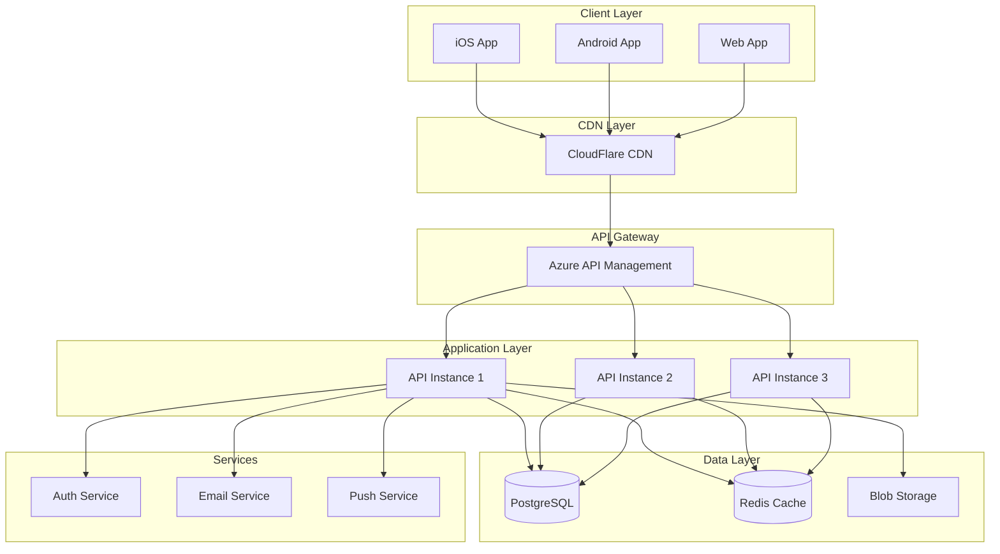

# GUIDE DE MAINTENANCE ET OPÉRATIONS - SUBEXPLORE
## Manuel DevOps et Administration Système

---

## TABLE DES MATIÈRES

1. [Infrastructure et Architecture](#1-infrastructure-et-architecture)
2. [Déploiement et Releases](#2-déploiement-et-releases)
3. [Monitoring et Alerting](#3-monitoring-et-alerting)
4. [Maintenance Base de Données](#4-maintenance-base-de-données)
5. [Gestion des Incidents](#5-gestion-des-incidents)
6. [Sauvegardes et Restauration](#6-sauvegardes-et-restauration)
7. [Sécurité Opérationnelle](#7-sécurité-opérationnelle)
8. [Procédures d'Urgence](#8-procédures-durgence)

---

## 1. INFRASTRUCTURE ET ARCHITECTURE

### 1.1 Vue d'Ensemble Infrastructure

```yaml
Infrastructure_Stack:
  Frontend:
    Mobile_Apps:
      - Platform: iOS/Android
      - Framework: .NET MAUI
      - Distribution: App Store, Google Play
    
    Web_App:
      - Framework: React
      - Hosting: Vercel/Netlify
      - CDN: CloudFlare
  
  Backend:
    API:
      - Framework: ASP.NET Core 8
      - Hosting: Azure App Service
      - Scaling: Auto-scaling enabled
    
    Database:
      - Primary: Supabase (PostgreSQL)
      - Extensions: PostGIS, pgcrypto
      - Backup: Daily automated
    
    Storage:
      - Images: Supabase Storage
      - CDN: CloudFlare
      - Backup: Azure Blob Storage
    
  Services:
    Authentication: Supabase Auth
    Email: SendGrid
    Push: Firebase Cloud Messaging
    Analytics: Application Insights
    Monitoring: DataDog
    Error_Tracking: Sentry
```

### 1.2 Environnements

```yaml
Environments:
  Development:
    URL: https://dev.api.subexplore.app
    Database: subexplore-dev
    Purpose: Development and testing
    Auto_Deploy: On push to develop
  
  Staging:
    URL: https://staging.api.subexplore.app
    Database: subexplore-staging
    Purpose: Pre-production testing
    Auto_Deploy: On push to staging
    Data: Anonymized production copy
  
  Production:
    URL: https://api.subexplore.app
    Database: subexplore-prod
    Purpose: Live environment
    Deploy: Manual with approval
    Monitoring: 24/7
```

### 1.3 Architecture Diagram



---

## 2. DÉPLOIEMENT ET RELEASES

### 2.1 Pipeline de Déploiement

```yaml
# .github/workflows/deploy-production.yml
name: Deploy to Production

on:
  push:
    tags:
      - 'v*'

jobs:
  deploy:
    runs-on: ubuntu-latest
    steps:
      - name: Checkout
        uses: actions/checkout@v3
      
      - name: Setup .NET
        uses: actions/setup-dotnet@v3
        with:
          dotnet-version: '8.0.x'
      
      - name: Run Tests
        run: |
          dotnet test --configuration Release
          
      - name: Build
        run: |
          dotnet publish -c Release -o ./publish
          
      - name: Database Migration Check
        run: |
          dotnet ef migrations script --idempotent -o ./migrations.sql
          
      - name: Deploy to Azure
        uses: azure/webapps-deploy@v2
        with:
          app-name: subexplore-api
          publish-profile: ${{ secrets.AZURE_PUBLISH_PROFILE }}
          package: ./publish
          
      - name: Run Smoke Tests
        run: |
          ./scripts/smoke-tests.sh ${{ env.PRODUCTION_URL }}
          
      - name: Notify Slack
        if: always()
        uses: slackapi/slack-github-action@v1
        with:
          payload: |
            {
              "text": "Production deployment ${{ job.status }}",
              "blocks": [
                {
                  "type": "section",
                  "text": {
                    "type": "mrkdwn",
                    "text": "Deployment to production: *${{ job.status }}*\nVersion: ${{ github.ref }}"
                  }
                }
              ]
            }
```

### 2.2 Procédure de Release

```bash
#!/bin/bash
# release.sh - Script de release

VERSION=$1
ENVIRONMENT=$2

echo "🚀 Starting release process for version $VERSION to $ENVIRONMENT"

# 1. Pre-flight checks
echo "✅ Running pre-flight checks..."
./scripts/preflight-checks.sh

# 2. Backup current version
echo "💾 Backing up current version..."
./scripts/backup-current.sh $ENVIRONMENT

# 3. Database migrations
echo "🗄️ Running database migrations..."
dotnet ef database update --context SubExploreContext

# 4. Deploy application
echo "📦 Deploying application..."
case $ENVIRONMENT in
  staging)
    ./scripts/deploy-staging.sh $VERSION
    ;;
  production)
    ./scripts/deploy-production.sh $VERSION
    ;;
esac

# 5. Warm up instances
echo "🔥 Warming up instances..."
./scripts/warmup.sh $ENVIRONMENT

# 6. Run health checks
echo "🏥 Running health checks..."
./scripts/health-check.sh $ENVIRONMENT

# 7. Smoke tests
echo "🧪 Running smoke tests..."
./scripts/smoke-tests.sh $ENVIRONMENT

# 8. Update monitoring
echo "📊 Updating monitoring dashboards..."
./scripts/update-monitoring.sh $VERSION

echo "✅ Release completed successfully!"
```

### 2.3 Rollback Procedure

```bash
#!/bin/bash
# rollback.sh - Script de rollback

ENVIRONMENT=$1
TARGET_VERSION=$2

echo "⚠️ Starting rollback to version $TARGET_VERSION"

# 1. Confirm rollback
read -p "Are you sure you want to rollback $ENVIRONMENT? (y/n) " -n 1 -r
echo
if [[ ! $REPLY =~ ^[Yy]$ ]]; then
    exit 1
fi

# 2. Check if target version exists
if ! azure webapp deployment list --name subexplore-api-$ENVIRONMENT | grep -q $TARGET_VERSION; then
    echo "❌ Version $TARGET_VERSION not found!"
    exit 1
fi

# 3. Initiate rollback
echo "🔄 Rolling back to $TARGET_VERSION..."
azure webapp deployment slot swap \
  --name subexplore-api-$ENVIRONMENT \
  --slot rollback \
  --target-slot production

# 4. Rollback database if needed
echo "🗄️ Checking database compatibility..."
./scripts/check-db-compatibility.sh $TARGET_VERSION

if [ $? -ne 0 ]; then
    echo "⚠️ Database rollback required"
    ./scripts/rollback-database.sh $TARGET_VERSION
fi

# 5. Clear caches
echo "🧹 Clearing caches..."
./scripts/clear-all-caches.sh $ENVIRONMENT

# 6. Health check
echo "🏥 Running health checks..."
./scripts/health-check.sh $ENVIRONMENT

# 7. Notify team
./scripts/notify-rollback.sh $ENVIRONMENT $TARGET_VERSION

echo "✅ Rollback completed!"
```

---

## 3. MONITORING ET ALERTING

### 3.1 Métriques Clés

```yaml
Key_Metrics:
  Application:
    - Response time (p50, p95, p99)
    - Request rate
    - Error rate
    - Success rate
    - Active users
    - API calls per minute
    
  Infrastructure:
    - CPU usage
    - Memory usage
    - Disk I/O
    - Network throughput
    - Container health
    
  Database:
    - Query performance
    - Connection pool usage
    - Lock waits
    - Slow queries
    - Replication lag
    
  Business:
    - New user signups
    - Active users (DAU/MAU)
    - Spots created
    - Bookings made
    - Revenue
```

### 3.2 Configuration DataDog

```python
# datadog_monitors.py
import datadog

monitors = [
    {
        "name": "High API Response Time",
        "type": "metric alert",
        "query": "avg(last_5m):avg:trace.aspnetcore.request.duration{env:production} > 1000",
        "message": "@slack-alerts API response time is above 1s!",
        "thresholds": {
            "critical": 1000,
            "warning": 500
        }
    },
    {
        "name": "High Error Rate",
        "type": "metric alert",
        "query": "sum(last_5m):sum:trace.aspnetcore.request.errors{env:production}.as_rate() > 0.05",
        "message": "@pagerduty Error rate is above 5%!",
        "thresholds": {
            "critical": 0.05,
            "warning": 0.02
        }
    },
    {
        "name": "Database Connection Pool Exhausted",
        "type": "metric alert",
        "query": "avg(last_5m):avg:postgresql.connections.active{env:production} > 90",
        "message": "@slack-database Database connection pool is nearly exhausted!",
        "thresholds": {
            "critical": 90,
            "warning": 75
        }
    },
    {
        "name": "Disk Space Low",
        "type": "metric alert",
        "query": "avg(last_5m):avg:system.disk.used{env:production} > 0.85",
        "message": "@ops-team Disk usage is above 85%!",
        "thresholds": {
            "critical": 0.85,
            "warning": 0.75
        }
    }
]

for monitor in monitors:
    datadog.api.Monitor.create(**monitor)
```

### 3.3 Dashboards

```json
// dashboard-config.json
{
  "title": "SubExplore Production Dashboard",
  "widgets": [
    {
      "definition": {
        "type": "timeseries",
        "title": "API Response Time",
        "requests": [
          {
            "q": "avg:trace.aspnetcore.request.duration{env:production}",
            "display_type": "line"
          }
        ]
      }
    },
    {
      "definition": {
        "type": "query_value",
        "title": "Current Active Users",
        "requests": [
          {
            "q": "sum:application.users.active{env:production}"
          }
        ]
      }
    },
    {
      "definition": {
        "type": "heatmap",
        "title": "Response Time Distribution",
        "requests": [
          {
            "q": "avg:trace.aspnetcore.request.duration{env:production} by {resource_name}"
          }
        ]
      }
    },
    {
      "definition": {
        "type": "top_list",
        "title": "Slowest Endpoints",
        "requests": [
          {
            "q": "top(avg:trace.aspnetcore.request.duration{env:production} by {resource_name}, 10, 'mean', 'desc')"
          }
        ]
      }
    }
  ]
}
```

---

## 4. MAINTENANCE BASE DE DONNÉES

### 4.1 Maintenance Routine

```sql
-- maintenance-weekly.sql
-- Script de maintenance hebdomadaire

-- 1. Update statistics
ANALYZE spots;
ANALYZE users;
ANALYZE reviews;
ANALYZE bookings;

-- 2. Reindex if needed
REINDEX TABLE CONCURRENTLY spots;
REINDEX TABLE CONCURRENTLY users;

-- 3. Vacuum tables
VACUUM (ANALYZE, VERBOSE) spots;
VACUUM (ANALYZE, VERBOSE) users;
VACUUM (ANALYZE, VERBOSE) reviews;

-- 4. Check for bloat
WITH bloat AS (
    SELECT
        schemaname,
        tablename,
        pg_size_pretty(pg_total_relation_size(schemaname||'.'||tablename)) AS size,
        round(100 * pg_total_relation_size(schemaname||'.'||tablename) / 
              NULLIF(sum(pg_total_relation_size(schemaname||'.'||tablename)) 
              OVER (), 0), 2) AS percentage
    FROM pg_tables
    WHERE schemaname NOT IN ('pg_catalog', 'information_schema')
    ORDER BY pg_total_relation_size(schemaname||'.'||tablename) DESC
)
SELECT * FROM bloat WHERE percentage > 1;

-- 5. Check slow queries
SELECT 
    calls,
    mean_exec_time,
    total_exec_time,
    query
FROM pg_stat_statements
WHERE mean_exec_time > 100
ORDER BY mean_exec_time DESC
LIMIT 20;

-- 6. Check index usage
SELECT
    schemaname,
    tablename,
    indexname,
    idx_scan,
    idx_tup_read,
    idx_tup_fetch,
    pg_size_pretty(pg_relation_size(indexrelid)) AS index_size
FROM pg_stat_user_indexes
WHERE idx_scan = 0
AND indexrelid > 16384
ORDER BY pg_relation_size(indexrelid) DESC;

-- 7. Update materialized views
REFRESH MATERIALIZED VIEW CONCURRENTLY mv_spot_statistics;
REFRESH MATERIALIZED VIEW CONCURRENTLY mv_user_activity;
```

### 4.2 Optimisation des Performances

```sql
-- performance-tuning.sql

-- Configuration PostgreSQL optimale pour SubExplore
ALTER SYSTEM SET shared_buffers = '4GB';
ALTER SYSTEM SET effective_cache_size = '12GB';
ALTER SYSTEM SET maintenance_work_mem = '1GB';
ALTER SYSTEM SET work_mem = '32MB';
ALTER SYSTEM SET max_connections = 200;
ALTER SYSTEM SET random_page_cost = 1.1;
ALTER SYSTEM SET effective_io_concurrency = 200;
ALTER SYSTEM SET min_wal_size = '1GB';
ALTER SYSTEM SET max_wal_size = '4GB';
ALTER SYSTEM SET wal_buffers = '16MB';
ALTER SYSTEM SET checkpoint_completion_target = 0.9;
ALTER SYSTEM SET autovacuum_max_workers = 4;
ALTER SYSTEM SET autovacuum_naptime = '30s';

-- PostGIS specific
ALTER SYSTEM SET postgis.gdal_enabled = 'on';
ALTER SYSTEM SET postgis.enable_outdb_rasters = 'on';

-- Apply changes
SELECT pg_reload_conf();

-- Create missing indexes based on usage
CREATE INDEX CONCURRENTLY IF NOT EXISTS idx_spots_created_user 
ON spots(created_by) WHERE is_active = true;

CREATE INDEX CONCURRENTLY IF NOT EXISTS idx_reviews_entity_rating 
ON reviews(entity_type, entity_id, rating) 
WHERE is_approved = true;

CREATE INDEX CONCURRENTLY IF NOT EXISTS idx_bookings_customer_date 
ON bookings(customer_id, booking_date DESC) 
WHERE status != 'cancelled';
```

### 4.3 Monitoring Base de Données

```python
# db_monitoring.py
import psycopg2
import datadog
from datetime import datetime

def check_database_health():
    """Monitor database health metrics"""
    
    conn = psycopg2.connect(
        host=os.environ['DB_HOST'],
        database=os.environ['DB_NAME'],
        user=os.environ['DB_USER'],
        password=os.environ['DB_PASSWORD']
    )
    
    metrics = {}
    
    with conn.cursor() as cur:
        # Active connections
        cur.execute("""
            SELECT count(*) 
            FROM pg_stat_activity 
            WHERE state = 'active'
        """)
        metrics['active_connections'] = cur.fetchone()[0]
        
        # Database size
        cur.execute("""
            SELECT pg_database_size(current_database())
        """)
        metrics['database_size'] = cur.fetchone()[0]
        
        # Longest running query
        cur.execute("""
            SELECT max(now() - query_start) 
            FROM pg_stat_activity 
            WHERE state = 'active'
        """)
        metrics['longest_query_duration'] = cur.fetchone()[0].total_seconds()
        
        # Cache hit ratio
        cur.execute("""
            SELECT 
                sum(blks_hit) * 100.0 / sum(blks_hit + blks_read) 
            FROM pg_stat_database
        """)
        metrics['cache_hit_ratio'] = cur.fetchone()[0]
        
        # Dead tuples
        cur.execute("""
            SELECT sum(n_dead_tup) 
            FROM pg_stat_user_tables
        """)
        metrics['dead_tuples'] = cur.fetchone()[0]
    
    # Send to DataDog
    for metric_name, value in metrics.items():
        datadog.api.Metric.send(
            metric=f"postgresql.{metric_name}",
            points=[(datetime.now().timestamp(), value)],
            tags=['env:production']
        )
    
    # Alert if issues
    if metrics['cache_hit_ratio'] < 90:
        send_alert("Low cache hit ratio", f"Cache hit ratio: {metrics['cache_hit_ratio']}%")
    
    if metrics['longest_query_duration'] > 60:
        send_alert("Long running query", f"Query running for {metrics['longest_query_duration']}s")
    
    conn.close()
    return metrics
```

---

## 5. GESTION DES INCIDENTS

### 5.1 Classification des Incidents

```yaml
Incident_Severity:
  P1_Critical:
    Description: Service completely down
    Response_Time: 15 minutes
    Resolution_Target: 2 hours
    Examples:
      - API not responding
      - Database down
      - Authentication broken
      - Data loss
    
  P2_High:
    Description: Major feature broken
    Response_Time: 30 minutes
    Resolution_Target: 4 hours
    Examples:
      - Booking system down
      - Search not working
      - Payment failures
      - Performance degradation > 50%
    
  P3_Medium:
    Description: Minor feature broken
    Response_Time: 2 hours
    Resolution_Target: 24 hours
    Examples:
      - Image upload issues
      - Notification delays
      - Minor UI bugs
    
  P4_Low:
    Description: Cosmetic issues
    Response_Time: 24 hours
    Resolution_Target: 1 week
    Examples:
      - Typos
      - Minor UI alignment
      - Non-critical warnings
```

### 5.2 Runbook - API Down

```markdown
# RUNBOOK: API Not Responding

## Symptoms
- Health check endpoint returning errors
- High error rate in monitoring
- Users reporting "Cannot connect" errors

## Initial Response (< 5 minutes)
1. Verify the issue
   ```bash
   curl -I https://api.subexplore.app/health
   ```

2. Check monitoring dashboard
   - DataDog: https://app.datadoghq.com/dashboard/subexplore
   - Application Insights: https://portal.azure.com/

3. Notify team
   - Post in #incidents Slack channel
   - Start incident call if P1

## Diagnosis (< 15 minutes)
1. Check Azure App Service status
   ```bash
   az webapp show --name subexplore-api --resource-group prod-rg
   ```

2. Review recent deployments
   ```bash
   az webapp deployment list --name subexplore-api --resource-group prod-rg
   ```

3. Check database connectivity
   ```bash
   psql -h subexplore-db.postgres.database.azure.com -U admin -d subexplore -c "SELECT 1"
   ```

4. Review error logs
   ```bash
   az webapp log tail --name subexplore-api --resource-group prod-rg
   ```

## Resolution Actions

### If deployment issue:
1. Rollback to previous version
   ```bash
   ./scripts/rollback.sh production v1.2.3
   ```

### If database issue:
1. Check connection pool
   ```sql
   SELECT count(*) FROM pg_stat_activity;
   ```

2. Kill long-running queries
   ```sql
   SELECT pg_terminate_backend(pid) 
   FROM pg_stat_activity 
   WHERE state = 'active' AND query_start < now() - interval '5 minutes';
   ```

### If resource issue:
1. Scale up App Service
   ```bash
   az webapp scale --name subexplore-api --resource-group prod-rg --instance-count 5
   ```

2. Clear Redis cache
   ```bash
   redis-cli FLUSHALL
   ```

## Post-Incident
1. Update status page
2. Write incident report
3. Schedule post-mortem
4. Update runbook if needed
```

### 5.3 Incident Communication

```python
# incident_communication.py
import requests
import json
from datetime import datetime

class IncidentCommunicator:
    def __init__(self):
        self.slack_webhook = os.environ['SLACK_INCIDENT_WEBHOOK']
        self.status_page_api = os.environ['STATUS_PAGE_API_KEY']
        
    def start_incident(self, severity, title, description):
        """Initiate incident communication"""
        
        # Create incident channel in Slack
        channel_name = f"incident-{datetime.now().strftime('%Y%m%d-%H%M')}"
        
        # Post to Slack
        self.post_to_slack({
            "text": f"🚨 {severity} Incident: {title}",
            "blocks": [
                {
                    "type": "section",
                    "text": {
                        "type": "mrkdwn",
                        "text": f"*Severity:* {severity}\n*Title:* {title}\n*Description:* {description}"
                    }
                },
                {
                    "type": "actions",
                    "elements": [
                        {
                            "type": "button",
                            "text": {"type": "plain_text", "text": "Join Incident Call"},
                            "url": "https://meet.google.com/subexplore-incident"
                        }
                    ]
                }
            ]
        })
        
        # Update status page
        self.update_status_page('investigating', title, description)
        
        # Send email to stakeholders
        self.notify_stakeholders(severity, title, description)
        
    def update_incident(self, update_message):
        """Send incident update"""
        
        self.post_to_slack({
            "text": f"📝 Update: {update_message}",
            "thread_ts": self.incident_thread_id
        })
        
        self.update_status_page('identified', update_message)
        
    def resolve_incident(self, resolution_message):
        """Mark incident as resolved"""
        
        self.post_to_slack({
            "text": f"✅ Incident Resolved: {resolution_message}",
            "thread_ts": self.incident_thread_id
        })
        
        self.update_status_page('resolved', resolution_message)
        
        # Schedule post-mortem
        self.schedule_postmortem()
```

---

## 6. SAUVEGARDES ET RESTAURATION

### 6.1 Stratégie de Sauvegarde

```yaml
Backup_Strategy:
  Database:
    Type: PostgreSQL logical backup
    Frequency: Every 6 hours
    Retention: 30 days
    Location: Azure Blob Storage
    Encryption: AES-256
    
  Files:
    Type: Incremental backup
    Frequency: Daily
    Retention: 7 days
    Location: Azure Blob Storage
    
  Code:
    Type: Git repository
    Frequency: On commit
    Retention: Forever
    Location: GitHub
    
  Configurations:
    Type: Encrypted vault
    Frequency: On change
    Retention: Versioned
    Location: Azure Key Vault
```

### 6.2 Script de Sauvegarde

```bash
#!/bin/bash
# backup.sh - Automated backup script

set -e

# Configuration
TIMESTAMP=$(date +%Y%m%d_%H%M%S)
BACKUP_DIR="/backup"
STORAGE_ACCOUNT="subexplorebackups"
CONTAINER="database-backups"

# Function to log
log() {
    echo "[$(date '+%Y-%m-%d %H:%M:%S')] $1"
}

# 1. Database backup
log "Starting database backup..."

PGPASSWORD=$DB_PASSWORD pg_dump \
    -h $DB_HOST \
    -U $DB_USER \
    -d $DB_NAME \
    -F custom \
    -b \
    -v \
    -f "$BACKUP_DIR/db_backup_$TIMESTAMP.dump"

# 2. Compress backup
log "Compressing backup..."
gzip "$BACKUP_DIR/db_backup_$TIMESTAMP.dump"

# 3. Encrypt backup
log "Encrypting backup..."
openssl enc -aes-256-cbc \
    -salt \
    -in "$BACKUP_DIR/db_backup_$TIMESTAMP.dump.gz" \
    -out "$BACKUP_DIR/db_backup_$TIMESTAMP.dump.gz.enc" \
    -pass pass:$BACKUP_ENCRYPTION_KEY

# 4. Upload to Azure
log "Uploading to Azure Storage..."
az storage blob upload \
    --account-name $STORAGE_ACCOUNT \
    --container-name $CONTAINER \
    --name "db_backup_$TIMESTAMP.dump.gz.enc" \
    --file "$BACKUP_DIR/db_backup_$TIMESTAMP.dump.gz.enc" \
    --metadata "timestamp=$TIMESTAMP" "type=database"

# 5. Clean up local files
log "Cleaning up local files..."
rm "$BACKUP_DIR/db_backup_$TIMESTAMP.dump.gz"
rm "$BACKUP_DIR/db_backup_$TIMESTAMP.dump.gz.enc"

# 6. Test backup integrity
log "Testing backup integrity..."
./scripts/test-backup.sh "db_backup_$TIMESTAMP.dump.gz.enc"

# 7. Clean old backups
log "Cleaning old backups..."
./scripts/cleanup-old-backups.sh 30

# 8. Send notification
log "Backup completed successfully!"
./scripts/notify.sh "Backup completed: db_backup_$TIMESTAMP.dump.gz.enc"
```

### 6.3 Procédure de Restauration

```bash
#!/bin/bash
# restore.sh - Database restoration script

BACKUP_FILE=$1
TARGET_ENV=$2

echo "⚠️ Database Restoration Process"
echo "Backup: $BACKUP_FILE"
echo "Target: $TARGET_ENV"

# Confirmation
read -p "This will overwrite the $TARGET_ENV database. Continue? (yes/no) " confirm
if [ "$confirm" != "yes" ]; then
    echo "Restoration cancelled."
    exit 1
fi

# 1. Download backup
echo "Downloading backup..."
az storage blob download \
    --account-name subexplorebackups \
    --container-name database-backups \
    --name $BACKUP_FILE \
    --file /tmp/$BACKUP_FILE

# 2. Decrypt
echo "Decrypting backup..."
openssl enc -aes-256-cbc -d \
    -in /tmp/$BACKUP_FILE \
    -out /tmp/backup.dump.gz \
    -pass pass:$BACKUP_ENCRYPTION_KEY

# 3. Decompress
echo "Decompressing backup..."
gunzip /tmp/backup.dump.gz

# 4. Create restoration point
echo "Creating restoration point..."
pg_dump -h $DB_HOST -U $DB_USER -d $DB_NAME -F custom -f /tmp/before_restore.dump

# 5. Restore database
echo "Restoring database..."
pg_restore \
    -h $DB_HOST \
    -U $DB_USER \
    -d $DB_NAME \
    -c \
    -v \
    /tmp/backup.dump

# 6. Verify restoration
echo "Verifying restoration..."
psql -h $DB_HOST -U $DB_USER -d $DB_NAME -c "
    SELECT 
        (SELECT COUNT(*) FROM users) as users,
        (SELECT COUNT(*) FROM spots) as spots,
        (SELECT COUNT(*) FROM bookings) as bookings;
"

# 7. Clear caches
echo "Clearing caches..."
redis-cli FLUSHALL

# 8. Restart services
echo "Restarting services..."
az webapp restart --name subexplore-api-$TARGET_ENV --resource-group $TARGET_ENV-rg

echo "✅ Restoration completed!"
```

---

## 7. SÉCURITÉ OPÉRATIONNELLE

### 7.1 Checklist Sécurité

```yaml
Security_Checklist:
  Access_Control:
    ✅ MFA enabled for all admin accounts
    ✅ Regular access reviews
    ✅ Principle of least privilege
    ✅ Service accounts rotated quarterly
    
  Secrets_Management:
    ✅ All secrets in Azure Key Vault
    ✅ Secrets rotation schedule
    ✅ No secrets in code/config
    ✅ Encryption at rest
    
  Network_Security:
    ✅ WAF enabled
    ✅ DDoS protection active
    ✅ SSL/TLS only
    ✅ Private endpoints for database
    
  Monitoring:
    ✅ Security alerts configured
    ✅ Audit logging enabled
    ✅ Intrusion detection active
    ✅ Regular security scans
```

### 7.2 Security Scanning

```bash
#!/bin/bash
# security-scan.sh - Automated security scanning

echo "🔒 Running security scans..."

# 1. Dependency scanning
echo "Checking dependencies..."
dotnet list package --vulnerable --include-transitive

# 2. Code scanning
echo "Scanning code for vulnerabilities..."
docker run --rm -v $(pwd):/src \
  aquasec/trivy fs --severity HIGH,CRITICAL /src

# 3. Container scanning
echo "Scanning Docker images..."
docker scan subexplore-api:latest

# 4. OWASP ZAP scan
echo "Running OWASP ZAP scan..."
docker run -t owasp/zap2docker-stable zap-baseline.py \
  -t https://api.subexplore.app -r zap_report.html

# 5. SSL/TLS check
echo "Checking SSL/TLS configuration..."
nmap --script ssl-enum-ciphers -p 443 api.subexplore.app

# 6. API security test
echo "Testing API security..."
python3 scripts/api-security-tests.py

# Generate report
echo "Generating security report..."
./scripts/generate-security-report.sh

echo "✅ Security scan completed. Check reports/ directory."
```

### 7.3 Incident Response Plan

```yaml
Security_Incident_Response:
  1_Detection:
    - Automated alerts
    - User reports
    - Security scans
    - Log analysis
    
  2_Containment:
    - Isolate affected systems
    - Block malicious IPs
    - Disable compromised accounts
    - Preserve evidence
    
  3_Eradication:
    - Remove malware
    - Patch vulnerabilities
    - Update configurations
    - Reset credentials
    
  4_Recovery:
    - Restore from backup
    - Monitor closely
    - Verify integrity
    - Update security measures
    
  5_Lessons_Learned:
    - Post-mortem meeting
    - Update procedures
    - Security training
    - Implement improvements
```

---

## 8. PROCÉDURES D'URGENCE

### 8.1 Contact d'Urgence

```yaml
Emergency_Contacts:
  On_Call:
    Primary: "+33 6 XX XX XX XX"
    Secondary: "+33 6 YY YY YY YY"
    Schedule: PagerDuty rotation
    
  Escalation:
    L1_Support: support@subexplore.app
    L2_DevOps: devops@subexplore.app
    L3_Engineering: engineering@subexplore.app
    Management: cto@subexplore.app
    
  External:
    Azure_Support: "0800 XXX XXX"
    Supabase_Support: support@supabase.io
    Security_Team: security@subexplore.app
    Legal: legal@subexplore.app
```

### 8.2 Disaster Recovery

```bash
#!/bin/bash
# disaster-recovery.sh - Full disaster recovery procedure

echo "🚨 DISASTER RECOVERY INITIATED"

# 1. Assess damage
echo "Assessing damage..."
./scripts/assess-damage.sh

# 2. Activate DR site
echo "Activating disaster recovery site..."
az group deployment create \
  --resource-group dr-rg \
  --template-file templates/dr-environment.json

# 3. Restore latest backup
echo "Restoring from latest backup..."
LATEST_BACKUP=$(az storage blob list \
  --container-name backups \
  --query "sort_by([?properties.lastModified], &properties.lastModified)[-1].name" \
  --output tsv)

./scripts/restore.sh $LATEST_BACKUP dr-environment

# 4. Update DNS
echo "Updating DNS to point to DR site..."
az network dns record-set a update \
  --resource-group dns-rg \
  --zone-name subexplore.app \
  --name api \
  --set "ARecords[0].ipv4Address=$DR_IP"

# 5. Verify services
echo "Verifying services..."
./scripts/verify-all-services.sh dr-environment

# 6. Communicate status
echo "Sending status updates..."
./scripts/send-dr-notification.sh "DR site active. Services restored."

echo "✅ Disaster recovery completed!"
```

### 8.3 Communication de Crise

```markdown
# Template - Communication de Crise

## Message Initial (T+0)
Nous rencontrons actuellement des difficultés techniques sur SubExplore. 
Nos équipes sont mobilisées pour résoudre le problème au plus vite.
Nous vous tiendrons informés de l'évolution de la situation.

## Update (T+30min)
Nous avons identifié la cause du problème et travaillons sur sa résolution.
Impact: [Description de l'impact]
ETA: [Estimation de résolution]

## Résolution
Le service est maintenant rétabli. 
Nous nous excusons pour la gêne occasionnée.
Un rapport détaillé sera publié dans les 24h.

## Post-Mortem (T+24h)
Rapport d'incident disponible: [Lien]
Actions correctives mises en place: [Liste]
```

---

## ANNEXES

### A. Scripts Utiles

```bash
# Collection de commandes utiles

# Logs en temps réel
az webapp log tail --name subexplore-api --resource-group prod-rg

# Status des services
curl -s https://api.subexplore.app/health | jq .

# Métriques database
psql -h $DB_HOST -U $DB_USER -d $DB_NAME -c "SELECT * FROM pg_stat_activity;"

# Clear cache
redis-cli FLUSHALL

# Restart services
az webapp restart --name subexplore-api --resource-group prod-rg

# Scale up
az appservice plan update --name subexplore-plan --resource-group prod-rg --sku P2V3

# Check SSL certificate
echo | openssl s_client -connect api.subexplore.app:443 2>/dev/null | openssl x509 -noout -dates
```

### B. Monitoring URLs

```yaml
Monitoring_Links:
  Dashboards:
    - DataDog: https://app.datadoghq.com/dashboard/subexplore-prod
    - Azure: https://portal.azure.com/#blade/resourcegroup/prod-rg
    - Grafana: https://grafana.subexplore.app
    
  Logs:
    - Application: https://portal.azure.com/logs/subexplore
    - Database: https://supabase.com/dashboard/project/logs
    
  Status:
    - Public: https://status.subexplore.app
    - Internal: https://internal-status.subexplore.app
```

---

**Document créé le**: {{DATE}}
**Version**: 1.0
**Dernière mise à jour**: À chaque incident majeur
**Propriétaire**: DevOps Team
**Contact**: devops@subexplore.app

*"Hope for the best, prepare for the worst"*

*SubExplore DevOps - Keeping the platform afloat 24/7* 🚀